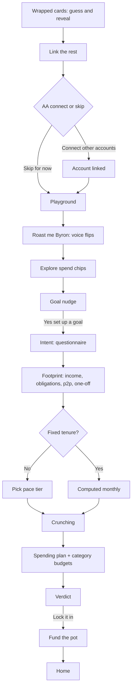

# new-user flow

A reference for the **new-user** persona in the aibanker-design proto: the first-run experience where a fresh slice user meets Ryan, links accounts, plays with their spend data, and sets up their first goal. It renders at `/app/new-user`. Two simulators drive it: **OnboardingSim** runs the linear onboarding script (wrapped cards, AA connect/skip, playground, goal questionnaire, footprint walk, plan, verdict, lock-in), and **GBPFlowSim** runs the standalone goal-creation chat (`story="clean-start"`) that the dev "Skip to → Goal: *" controls jump straight into. The page chooses between them on `userState.bootGoalCreation`: when set it mounts GBPFlowSim, otherwise OnboardingSim until `onboardingComplete` flips true. The persona is a steady earner with short-term goals (a trip, a gadget, an emergency fund), arriving via Account Aggregator with thin-but-real transaction history.

---

## Happy path



---

## Onboarding walkthrough (OnboardingSim)

This is the default new-user path (`terminalAtAa` false). Each `bot` step carries a `{ ryan, byron }` ref and renders `step.dv[voice]`; lines typewrite and auto-advance.

### Wrapped cards (guess and reveal)

Two intro bubbles open the flow. Ryan: `"Three months. Three patterns. A few surprises."` then `"Let's see how well you actually know your money."` Then a horizontally-scrolling deck of **3 face-down cards** (each a tiled "?"). Tapping a card opens a full-screen guess-then-reveal story:

1. `"How many times did you order from Swiggy in the last 3 months?"` (30-50 / 50-100 / 100-150 / 150+; correct 100-150). Reveal: `"143 times."` Ryan: `"The fridge isn't doing much, is it?"`
2. `"Who did you send the most money to?"` Reveal: `"Aditya."` Ryan: `"Get a joint account already, you guys!"`
3. `"What's the most expensive day of the week for you?"` Reveal: `"Tuesdays are your most expensive day."` CTA `"Let's go"`.

Revealed cards flip face-up to show the data. Once all 3 are revealed it auto-advances and snap-scrolls to the next bubble.

> Note: two stale code comments say "five beats" / "5 beats" but `WRAPPED_BEATS` has only 3 entries; the gate is `WRAPPED_BEATS.length`, so the real behavior is 3.

### Link the rest

Ryan: `"Your slice accounts already tell me a lot. Link the rest and I'll have the full picture."`

### AA connect / skip

`aaMode` for new-user is `"optional"`, so both chips render:

- **"Connect other accounts"** opens the AA flow (`AASim`). On complete, the new-user path advances to the linked bubble and continues linearly. It does **not** set `aaConnected` true, so the user gets the normal playground (branch 3), not the connect mosaic.
- **"Skip for now"** jumps straight to the playground; the in-between linked/intro bubbles are filtered out.

If the user dismisses the AA sheet after picking, a nudge shows: `"No stress. You can connect whenever. But the more accounts I see, the sharper I get."` plus a re-offered connect button.

On connect, Ryan: `"HDFC Bank ••4829 is linked. I'm pulling in your transactions now, so I can see where your money really goes."` Then: `"This takes a few seconds. Piecing it all together."` and `"Meanwhile, want to see what I can do?"`

### Playground (explore + roast)

Four chips exist: **"Top categories, last 3 months"**, **"My month-to-month story"**, **"What my spending says about me"**, **"Roast me, Byron"**.

The 3 spend chips are **hidden until the user fires a roast first** (`playgroundRoastFiredOnce`). The "Roast me, Byron" chip shows by default (under a cap of 2 roasts; `byronGatedByAa` is false for new-user).

Tapping a spend chip reveals a data card, then a quip after a 1.5s hold so the card lands first. Examples:
- Top categories: `"Food's running the show. ₹64K across three months. Shopping's a close second."`
- Month story: `"March got away from you..."`
- Spending says: a heatmap + traits ("Monday spender") with a first-half-of-week quip.

**Roast me, Byron** is where the voice flips. Byron's roast is generated dynamically by `buildRoast` (food-heavy branch, since the input is 143 orders / ₹42,000 and no category caps) and seed-cycled per tap, so consecutive taps yield variant phrasings (e.g. a "your fridge is a museum" line). On the first roast the app bar switches to the dual-voice toggle, content fades out, `voice` flips to Byron, and the roast streams. After it finishes, it holds on Byron then fades back to Ryan: `"Byron's a bit much. But he means well. If tough love is what you like, you know where to find him."` Subsequent roasts stay on Byron. At the cap (2): `"Alright, you've heard the worst of it. Want to actually do something about it? Set a goal."`

### Goal nudge

Once a roast has fired AND all 3 spend chips are consumed, the nudge appears. Ryan: `"Looking at data only gets you so far. Let's set a goal so we can actually manage your money together."` Then chips render: **"Yes, set up a goal"** (jumps to the questionnaire), and if goals aren't required, **"Take me home"** (completes with `skipGoal`). A repeat roast button shows if Byron is still under cap.

### Goal questionnaire (intent)

Opens as an overlay quiz, auto-opening 400ms after the step activates. Base questions:
1. `"What are you working toward?"` (A trip / Emergency fund / Big purchase / Just save more)
2. `"Where are you headed?"` (free-text)
3. `"By when?"` (3 / 6 / 12 months / Flexible)
4. `"Roughly how much?"` (₹50k / ₹1L / ₹2L / ₹5L+)

The set is branched by goal type: `trip` → goal + destination ("Where are you headed?") + timeline + amount; `purchase` → goal + destination ("What are you buying?") + timeline + amount; `emergency` → goal + amount only; `save-more` → goal only. Finishing derives a `goalLabel` (e.g. `"Trip to {destination}"`), shows a `"Shared preferences"` bubble, and advances. Dismissing shows: `"No worries. Whenever you're ready. A goal makes everything I do sharper though."` plus a "Set a goal" re-open button.

### Footprint walk

Ryan: `"Got it. Let me walk you through your money so we're on the same page before I build the plan. First, what's coming in."` Then four confirm-list cards, one bot line each:
- **Income** (Wipro ₹72,000, Dad ₹10,000) — then `"Income's steady. Now let's look at what's already spoken for each month."`
- **Obligations** (Rent ₹15,000, Car EMI ₹8,000, Netflix ₹199, Spotify ₹119, SIP ₹5,000) — then `"That's the fixed stuff. Now the money that moves between you and people you know."`
- **P2P** (Roommate ₹5,000) — then `"Light P2P. Finally, the one-off stuff — refunds, repairs, surprise medical bills."`
- **One-off expenses** (Doctor visit ₹3,000, Laptop repair ₹4,500)

Each confirm advances to the next bucket.

### Pace picker (ladder)

Ryan: `"Now the pace. Pick the one that feels right."` Opens the tier picker: `"How much to save a month?"` (Comfortable / Realistic / Stretch, color-coded). **Skipped if the goal has a fixed tenure** (a trip/purchase with both concrete amount and deadline) — a single `requiredMonthly` is computed instead and the "Now the pace" line is swapped for a computed-monthly line like `"To hit {potLabel} {timeline}, you'll need about {₹x}/month. Here's how that lands."`

### Crunching

Ryan: `"Crunching the numbers..."` A floating cruncher card cycles `"Checking your cashflow"` → `"Optimising monthly allocation"` → `"Building your plan"` (900ms each), then advances.

### Spending plan

Ryan: `"Here's the plan."` A goal-aware text block plus a **category-budgets** card. Numbers from the plan fixture (income ₹82,000, obligations ₹28,318) with safe-to-spend as the resolved daily pool. Has an `isPlanTight` variant.

### Verdict

A goal-aware line. Branches by `isPlanTight` (e.g. `"Heads up — {amt} a month is more than your spare cash..."`), `purchase` (`"This works. {amt} a month gets you {goalLabel}."`), `emergency`, `save-more`, else a default.

### Lock-in

Chips: **"Lock it in"** / **"Tweak something"**.
- Lock it in → `"Locked in. One thing left — let's fund {potLabel} and put the monthly on autopay."` then an add-to-pot funding widget. Funding sets the plan locked and shows `"Done — {potLabel} is live..."`
- Tweak something → a real text input; on submit, a rework line then the same funding widget.

Funding the pot fires `onComplete` with the goal payload → home.

---

## Goal-creation chat phases (GBPFlowSim, clean-start)

The standalone chat (reached via the dev "Goal: *" jumps, or as the questionnaire's spiritual sibling) runs this phase chain: **entry → destination-pick → ladder → footprint-walk → spending-plan → verdict → done**. (The `Phase` type also lists `lock-in`, but clean-start never assigns it — verdict jumps straight to `done`.)

### entry → destination-pick

User: `"I want to save more"`. Ryan: `"I can help with that. First, are you saving toward something specific, or just want to build up savings in general?"` Chips: **"Yes, saving toward something"** / **"No, just save more"**.

### ladder

Ryan: `"Got it. Based on your finances, here are three savings tiers. Pick the pace that feels right."` Inline tier card `"How much to save a month?"`. Picking it echoes the amount (e.g. "₹12,000 a month"), then: `"₹12k/month it is. Want to name this destination? I'll call it \"Emergency fund\" for now.\n\nBefore I can tell you if this works, I need to walk through your finances. It's quick, five checks."`

### footprint-walk

Four confirm-list buckets, one at a time, each with a generated `"₹X label, looks right"` user echo:
- Income → `"Here's what I see coming in regularly. Confirm what's accurate so I can build your plan on solid numbers."` → `"Noted. ₹82k/month coming in. 3 more checks after this."`
- Obligations → `"These are your committed monthly expenses. Anything missing or wrong?"` → `"Noted. ₹28,318/month in obligations. 2 more checks."`
- P2P → `"You're moving meaningful amounts with your roommate. Confirming means I'll treat the net ₹5k as a recurring inflow."` → `"Got it. 1 more check."`
- One-off → `"These look like one-offs, not something to plan around monthly. Flag any that are actually recurring."` → `"All checks done. Crunching your spending plan now."`

> The tax refund is deliberately kept out of the one-off *expenses* bucket — it is sporadic income, not an outflow.

### spending-plan

Ryan: `"Here's how your money breaks down with ₹12k/month going to savings."` Renders the budget summary + category budgets (staggered 180ms behind).

### verdict → done

Ryan: `"₹12k/month is doable. Just need to bring food spend a bit closer to peer average. Nothing drastic."` Chips: **"Lock it in"** / **"Tweak something"** (both route to the same locked outcome). Then: `"Locked in. Your emergency fund pool is live at ₹12k/month. Budgets set across 6 categories. I'll keep an eye on things."`

> The five "blocked" stories (goal-exists, pool-exists, both-exist, impossible-amount, cashflow-blocked) are separate from clean-start; each boots a 2-message entry, surfaces chips, then funnels into the same footprint walk after a choice.

---

## Voices — Ryan vs Byron

- The default voice is **Ryan** (calm, plain). **Byron** is the tough-love alter ego.
- Byron is introduced via the **"Roast me, Byron"** chip in the playground. On the first roast the app bar gains a voice toggle and the content fades into Byron's voice. After the roast, it hands back to Ryan, who explains Byron is `"a bit much. But he means well."`
- Once introduced, the toggle lets the user flip voice manually; every rendered string reads `dv[voice]`, so all bot lines, quips, verdict, plan and lock-in copy track the active voice.
- `introduceByron` defaults true and `byronGatedByAa` defaults false for new-user, so the roast chip is available by default. There is a roast cap of 2.

---

## Budget concepts

### Safe to spend

The number the user lives by is a forward cashflow position, not the bank balance:

```
+ Income
− Obligations
− Savings target
─────────────
= Safe to spend
```

For the fixture: ₹82,000 − ₹28,318 − ₹12,000 = **₹41,682**. The same is derived live as `leftToSpend = income − obligations − savingsAmount`, floored at 0 (never shown negative). When savings ≥ available, the verdict flags `isPlanTight`.

> The field is named `dailyPool` in the fixture; its "Safe to spend" display label lives in `BudgetSummaryViz.tsx`, tagged with a PRD §3.4 code comment.

### Category budgets (typical spend → suggested)

Proposed from history; each row shows current spend → suggested cap. Six categories (the count matches "Budgets set across 6 categories"), including a Misc lump for projection margin:

| Category | Typical spend | Suggested cap |
|---|---|---|
| Food & dining | ₹9,000 | ₹8,000 |
| Transport (biggest cut) | ₹5,000 | ₹3,000 |
| Shopping | ₹4,500 | ₹4,000 |
| Subscriptions | ₹1,200 | ₹1,200 |
| Groceries | ₹3,000 | ₹3,500 |
| Misc | ₹2,100 | ₹2,300 |

### Savings tiers (for "just save more")

When there's no fixed-tenure target, the user picks a pace. Color-coded by how hard it is:

| Tier | Monthly | Tag | Description |
|---|---|---|---|
| Comfortable | ₹5,000 | green | `"This is what you can save without changing a thing."` |
| Realistic | ₹12,000 | amber | `"Doable with a couple of small tightens."` |
| Stretch | ₹20,000 | red | `"Ambitious. Some months will feel tight."` |

---

## Dev "Skip to" states

The new-user persona exposes a "Skip to" control with 14 jumps (milestones, then goal stages). Onboarding milestones drive OnboardingSim's `startMilestone`; goal stages set `bootGoalCreation` and route to GBPFlowSim's `bootStage`.

| # | Label | Lands on |
|---|---|---|
| 0 | Start | Top of onboarding (wrapped step), nothing seeded |
| 1 | Cards to flip | Wrapped step, deck still face-down (revealedCount 0), pre-AA |
| 2 | Before connecting | The AA connect / skip prompt, no account linked yet |
| 3 | Account connected | Post-AA-connect seed (connect mosaic), sync still running |
| 4 | Byron intro | New-user playground (branch 3) with `aaConnected` false, Byron forced on — the meet-Byron state |
| 5 | Spend snapshot ready | Post-AA seed, sync done (connect mosaic) |
| 6 | Asked a question | Post-AA seed, sync done + one engaged reveal (top-categories) |
| 7 | Goal: start | GBPFlowSim, `bootGoalStage` undefined (boots from top) |
| 8 | Goal: intent | GBPFlowSim at `intent` — questionnaire / destination-pick |
| 9 | Goal: tier | GBPFlowSim at `tier` — ladder picker shown |
| 10 | Goal: footprint | GBPFlowSim at `footprint` — income bucket shown |
| 11 | Goal: plan | GBPFlowSim at `spending-plan` — budget summary + categories |
| 12 | Goal: verdict | GBPFlowSim at `verdict` — verdict + lock-in chips |
| 13 | Goal: locked in | GBPFlowSim at `done` — locked-in transcript |

> The "byron" / "snapshot" / "asked" milestones share the post-AA seed; only "byron" keeps `aaConnected` false (landing on the new-user playground), while "snapshot"/"asked" target the connect mosaic. The `Goal: plan` label maps to stage `"spending-plan"`, and `Goal: locked in` maps to stage `"done"`.

Switching toggles is clean and idempotent: each change rebuilds full state from the pristine preset base, re-applies every group's selection in order, and force-remounts the sim via its `key` so no stale internal state carries over. The four control groups (Skip to, Account aggregator, Voice, Goal setup) write disjoint fields, so order never matters.

---

## Why it works this way (PRD rationale)

- **Who it's for:** steady earners with short-term goals (trip, gadget, emergency fund). Long-horizon investing is out of scope. Everyone arrives via AA, so there's almost always history — but it can be thin or slow, and when it's too thin for an honest number, we say so and wait rather than fabricate.
- **Intent-first, data-second:** AA data has latency, so onboarding asks for intent (the goal needs no data) and doesn't block on transactions. We keep the user busy in the playground while data arrives, then deliver the budget and number once it's ready.
- **The goal-vs-pool fork, never a dead end:** nudge toward a specific goal; with nothing in mind it becomes a pool (default: emergency fund); reject even that and it's a destination-less "save more" that still moves money to a pot.
- **The number is honest:** specific goals get one number plus a feasibility check (extend timeline / lower target if infeasible; ₹0 is a valid answer, never an invented positive). "Just save more" gets the three tiers off the user's own cashflow.
- **Safe to spend, not balance:** the anchor is forward free cash after everything committed including reserved saving (income − obligations − savings).
- **Propose-from-history, confirm-first:** the budget is a few categories plus Misc, proposed from history; the footprint walk surfaces what we assumed for the user to confirm one bucket at a time; the plan is never set silently — the user always locks it in.

> Accuracy flags from the PRD comparison: the proto's middle tier is **"Realistic"**, not the PRD's "Flexible"; the literal home hero `"on track to save ₹X for [goal]"` isn't present verbatim (home uses status/daysLabel goal cards); and the fully-linear "deliver the number once AA lands" flow is config-gated behind `terminalAtAa` (off for new-user) with the goal question sitting after the AA link in step order — intent-first in spirit, not literal ordering.

---

## Key files

| File | Owns |
|---|---|
| `/Users/anirudhbhat/claude/aibanker-design/app/preview/OnboardingSim.tsx` | The linear onboarding script (`ALL_STEPS`): wrapped, AA, playground, questionnaire, footprint, plan, verdict, lock-in; dual-voice state; `startMilestone` fast-forwards; `onComplete` payload |
| `/Users/anirudhbhat/claude/aibanker-design/app/preview/GBPFlowSim.tsx` | The standalone goal-creation chat: `Phase` progression, blocked stories, `bootStage` seeding |
| `/Users/anirudhbhat/claude/aibanker-design/app/preview/fixtures/wrappedFixture.ts` | Wrapped beats, AA/playground/goal-nudge copy, playground reveals, goal-preference questions, Byron handoff/cap copy |
| `/Users/anirudhbhat/claude/aibanker-design/app/preview/fixtures/gbpFlowFixture.ts` | Story-1 message strings, destination/tier/lock-in chips, footprint buckets, category budgets, spending-plan fixture |
| `/Users/anirudhbhat/claude/aibanker-design/app/preview/fixtures/savingsTierQuestion.ts` | The inline savings-tier question card + color-coded pace tags |
| `/Users/anirudhbhat/claude/aibanker-design/app/components/BudgetSummaryViz.tsx` | Safe-to-spend headline + breakup (income / obligations / savings) |
| `/Users/anirudhbhat/claude/aibanker-design/app/components/CategoryBudgetsViz.tsx` | Category budgets card (typical spend → suggested cap) |
| `/Users/anirudhbhat/claude/aibanker-design/app/lib/gbp-logic.ts` | Plan math (floors safe-to-spend at 0) |
| `/Users/anirudhbhat/claude/aibanker-design/app/lib/roast.ts` | `buildRoast` — Byron's dynamic, seed-cycled roast text |
| `/Users/anirudhbhat/claude/aibanker-design/app/data/userStatePresets.ts` | The `new-user` preset, control groups, Skip-to substates, `applySubstate` |
| `/Users/anirudhbhat/claude/aibanker-design/app/(main)/app/[persona]/page.tsx` | Renders the device frame: chooses GBPFlowSim vs OnboardingSim, maps config, handles `onComplete` → home state |
