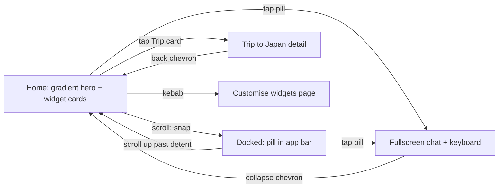

# return exp1 — returning-user dashboard experiment

> **2026-09-23 follow-up — the nil card settled, and paid on the payments
> page:** The message is the cashflow card's one nil state; zeros and ghost
> bars left the switch (user call), which now reads Live, Nil, and the two
> in-and-out months. Its copy is shorter, "Nothing in or out yet" over "Fills
> in as money moves" (user call), so the chart is the copy's 40 and the card
> 134. The dashed rules came back behind the ghost cluster (user call), three
> at a 16 pitch, and the chart fills the row beside the copy the way it does
> beside the legend. On the payments page the head gains the budget head's
> third line (user call), 12 under the figure: "1 paid • 2 left". A paid row
> says "Paid" in positive green under its amount (user call); Rent, on the
> 3rd, is the one.

> **2026-09-23 follow-up — Recurring spends:** The home card is called
> "Recurring spends" now (user call), and Total + next is its only look; the
> switch left the debug panel (user call). The month's ₹23,700 is the H2
> figure, and under it how many are paid and how many are left, "1 paid • 2
> left" (user call), then a dashed rule and the next payment still to go out,
> Electricity on the 15th. Today is the 8th, so Rent on the 3rd counts as paid.
> The payments page's rows carry their own day on the calendar tile (3, 15,
> 22); every tile read 12 before. "Bills this month: All paid or none" still
> drops the card.

> **2026-09-23 follow-up — the message nil, balanced:** "Nil · message" still
> took too much space and did not feel balanced (user call). Its chart is now
> exactly the copy's height, 56 (the 20 headline, 4, two 16 caption lines), in
> a 48 column with no rules, and the ghost cluster's tallest bar fills it. It
> reads as a glyph beside the message rather than an empty chart, and the card
> is 150 against the live card's 306.

> **2026-09-23 follow-up — the message nil with ghost bars, and upcoming
> summaries:** **Nil · message** now carries the ghost cluster beside its copy
> (user call), on a chart cut down to 80 so the card is as short as its
> message, 174 against the live card's 306 (user call). The chart narrows to 72
> so the copy runs two lines, not four, and the ghost scales with the chart's
> height. The Upcoming card has a switch again, **One row** leading, plus three
> looks that say how many are coming and about how much before the next
> payment (user call): **Total + next** (₹23,700 as the H2 figure, "3 spends
> due this month", a dashed rule, then the next row), **Callout + next** ("3
> spends coming up, about ₹23,700", then the row under "Next up") and **Count
> in heading** ("3 spends • ₹23,700" on the heading's own line). Any of them
> opens the whole list, as before.

> **2026-09-23 follow-up — cashflow and upcoming card states, and a bank that
> fails to fetch:** The Oct Cashflow card gets states on the debug panel
> ("Cashflow card"). Live is October. Three takes on a month with nothing in
> it: **Nil · zeros** keeps the card whole at ₹0 three times, each bar a 4px
> nub in the track colour on the baseline; **Nil · ghost bars** keeps the ₹0s
> over the cluster sketched in the track colour (shapes, not figures); **Nil ·
> message** drops the figures and the chart for "Nothing in or out yet" over
> "Money in, out and invested this month shows up here". Two more for a month
> that invested nothing, so Investments drops out whole: **no inflow** (₹0 in,
> ₹20,800 out) and **no outflow** (₹50,000 in, ₹0 out). With two rows the
> chart is as tall as the legend, 132 instead of 212, so the card gets shorter
> too (user call); the rules hang from the baseline at the same 45 pitch and
> the tallest bar keeps its 39 of air.
> Upcoming spends is now the payments page's own row, just the first payment
> (Rent, ₹20,000); the rest are on the page. R74's three calendar tiles are
> gone, and so is the switch (user call: one row is the default). "Bills this
> month" set to **All paid or none** drops the card from the feed (user call:
> with every bill paid, or none due, the card is not shown).
> The bank page's "Linked banks" is three states: **3 banks**, **1 bank** (the
> row layout won; the account-as-head one is gone), and **3 banks · 1
> failed**: SBI xx8846 reads "Couldn’t fetch balance" on a red dot with a Retry
> where its amount was, and the total counts only the two that came back
> (₹6,875), since a stale figure would read as current.

> **2026-09-23 follow-up — budget history as a carry-over story:**
> The clock glyph's page was a plain list of past months read against today's
> cap. The budget carries over now: what a month leaves rolls into the next
> one, what it overspends comes out of it. The page is just the list (user
> call: no head figure, no section band), flush under the app bar like the
> bank page (no hero spacer, no top padding): one List item/Deposit row per
> month, the live month first and the past ones below it as you scroll, on a
> 2px rail running avatar centre to avatar centre. Each row: the allocations'
> 48 avatar with no progress on it (user call; the calendar tile was tried and
> reverted) and the month's short name inside, the month over that month's
> budget, and on the right "₹8,542 left" / "₹3,342 over" over "₹20,320
> spent". The carry-over reads in the budget itself — the monthly figure plus
> what the month before left or overspent: June ₹27,776, July ₹28,862, August
> ₹36,318, September ₹24,434, October ₹29,500. The transfer beats that sat on
> the rail between months were tried and removed (user call). October reads
> the budget page's own spend ("₹15,200 left", on track). The past spends are
> the cashflow's own category history, so every month agrees with the
> cashflow drill; the monthly figure (₹27,776, from June) is solved from them
> so the chain lands October on exactly the ₹29,500 cap the budget page reads.

> **2026-09-23 follow-up — the bank page with one bank, and its graph off:**
> The balance graph leaves the bank page for now (user call). The head (label,
> total, refresh line) sits the head's standard 32 over the "Bank accounts (3)"
> band, and the debug panel's "Bank balance graph" brings the line back exactly
> as R72 drew it. The page also gets a one-bank state (Vishal's call), in two
> layouts under "Linked banks" for the designer to choose between.
> **1 bank · head:** the account is the page. Its 40px logo avatar, on the
> row's subtle rim, leads; "HDFC Bank • xx2831" takes the label's place; then
> the balance and the refresh line. No band and no list, since one row would
> only repeat the head. **1 bank · row:** the page keeps its shape. "Balance"
> (there is nothing to total), a "Bank account" band without a count, and the
> one List item / Transaction row. In both, the one account holds the whole
> ₹8,000, so the head, the home figures and the graph still close. Three banks
> stays the default.

> **2026-09-22 follow-up — the month with nothing invested, and what leaving
> looks like:** A month that invested nothing drops the Investments series, and
> every part of that drop was a blink. The heading's two remaining columns now
> read at a bigger size — the label at the canon's own 14, the figure
> proportionally, four between the two line boxes, half the selected stack's
> eight — and sit 64 either side of the centre instead of adrift at the thirds.
> Only the PAIR: at three columns the type is exactly as it was (user call).
> The bar no longer widens to 16 to hold the trio's cluster width; a bar that
> changes width by what is MISSING reads as a data change, so it stays at 10.
> The dropped column stops unmounting: it holds the centre it had, fades and
> scales to 0.7 on one curve and one clock (user call — split curves read as two
> events, and a subtler scale spent its whole shrink under glyphs already too
> faint to measure it against), while the pair closes over it. Its ledger row
> collapses its height rather than vanishing, so Outflow rides the gap up, and
> both the row and the column HOLD the nearest month that did invest instead of
> rolling to ₹0 on the way out — the figure would change before the thing
> showing it was gone.
>
> The average line leaves the way it arrives. It never unmounts now: the
> overview parks it transparent and 8px low, and the drill is a rise and a fade,
> reversed exactly on the way back. Its Y is the catch — the overview has no
> average of its own, the figure there is the outflow's, so crossing moved the
> line by about the same 8 the rise lifts it. On Inflow the two cancelled and
> the move read as inverted; on Investments, whose average sits 38 lower, the
> sum came out as a slide DOWNWARD (user call: it should always slide from the
> bottom up). Leaving, it holds the Y of the level it came from; entering, it
> takes the new Y in a single unseen frame, with `top` dropped from the
> transition list on the crossing render alone. Between two drill levels nothing
> is crossing and the Y travels as it always did.
>
> The app bar's name goes with them: inside the cashflow family the bar does not
> ride — the levels share one mounted page — so a drill swapped "Cashflow" for
> an empty string in place and it blinked out. It keeps reading "Cashflow" all
> the way down and only turns invisible, which is what gives the fade something
> to fade.
>
> And the heading runs on Rubik's PROPORTIONAL figures now, like the bank
> balance and the ledger rows under it (user call: the same variable kerning and
> fluid text the L1 and the bank chart have). It had been pinned to tabular so
> the run's width moved only when the DIGIT COUNT did — measured, proportional
> advances spread five 5-digit values across 17.4px, and centred that is the
> number drifting left and right under you. Scrubbed, though, that drift IS the
> gesture: DASH2_FIGURE_DEFORM spends it as scaleX so the width travels rather
> than jumps, and holding the width still took the gesture with it.

> **2026-09-22 follow-up — a drill's back button belongs to the page it opens:**
> A transaction pushed from a tracker or a category slid in UNDER a back chevron
> that never moved (user pin: "this transaction page doesn't have a back
> button... it should overlap the last page's back button"). The chevron was
> held still on purpose so only one glyph was ever on screen; what it actually
> read as was the previous page's button, with the new sheet passing beneath it.
> It now rides in with its own bar and lands over the chevron of the level it
> covers — and on the way back it leaves with its page, uncovering the one
> beneath — which is the handover home → L1 has always played.

> **2026-09-22 follow-up — the bare glyph comes back, on canon:** The designer
> points at **3115:92873**, which draws both ring cards — Trip to Japan and the
> food tracker — with nothing in the hole but the object's own glyph: a 32px
> `Objects/Flight` in blue, a 32px `Objects/Food` in orange, centred in the 93px
> chart, no coin, pane, tile or disc behind either. That is the plainest of the
> four frameless reads cut earlier today, and it returns as a sixth
> Tracker-icon-holder option, **Bare glyph** — one `PlainRingGlyph`, the icon
> masked to the tracker's tone at the canon's 32 (the cut set sat at 30). A
> deliberate re-add against canon, confirmed with the designer, not a
> stale-base revert of that cut. It follows the avatars through the goal card,
> where it swaps the Trip to Japan object for the blue flight glyph; the two
> `holderRaw.startsWith("avatar")` tests there are now one `swapsGoalObject`,
> so the art and percent fallbacks stand down for either family, while the
> avatar branch keeps its own 48/40 split untouched. A brand logo runs through
> it like every other holder, alone at the same 32. The default is unchanged.

> **2026-09-22 follow-up — the holder set, cut to five:** The exploration closes
> (user call: "keep coinage, hologlass, hololens, and avatar, remove all the
> rest"). Out of the panel and out of the file: the four frameless glyph reads
> (Glyph, mono, glow, lit) and the four avatar treatments (soft, ring, gradient,
> halo) — `Dash2BareGlyph` is deleted and `PlainRingAvatar` is one flat disc
> again, git history keeping the rest. What stays: the tilted edged coin, the
> two holo-glass panes, and the avatar, which now comes at two sizes — the
> canon's 48 and a new **Avatar · small** at 40, where more of the ring's hole
> shows around it. The glyph scales with the disc on the canon's 20-in-48 ratio
> (17 at 40); a brand logo still takes the whole face at either size. Both sizes
> reach the goal card as well as the tracker, as the flat avatar always did.

> **2026-09-22 follow-up — the feed's tracker is Swiggy, and it wears Swiggy:**
> The built-in tracker card stops being a food-category stub and becomes the
> thing the tracking flow itself picks (user call: "this card about Swiggy
> spends and tracking Swiggy spends, and make the avatar a Swiggy logo"). One
> `DASH2_DEFAULT_TRACKER` — the `TRACKABLES` Swiggy row capped at the first cap
> that flow offers — now feeds the card, the tracking page it opens and the
> stop-tracking sheet, so the three cannot drift: ₹1,400 of a ₹2,000 cap over
> one order, the arc at 70%, Swiggy's own #FC8019 leading the Tracker-colour set
> as the default. The tracking page reads the same row and its big ring takes
> the tracker's colour instead of the goal blue (`Dash2BigRing` gains a `tone`),
> which also gives every session-made tracker — Zomato red, Shopping pink — a
> detail page that matches its card.
>
> **Tracker mark**, a new debug flag, switches the thing in the holder between
> the **brand logo** (default) and an **app icon**; the Tracker-icon picker now
> carries a `showWhen` so it only draws while the app icon is showing, since a
> raster logo cannot be tinted. The logo runs through every holder: the filled
> avatars hand it their whole face, the two surround-led ones (soft, ring) set
> it inside at 28, the frameless reads show it alone at 30, and the coin and
> holo panes carry it on their face. One `BrandMark` primitive draws it
> everywhere — and it clips to a circle and blows the file up 6%, because every
> merchant asset carries a pale rgb(228,232,243) rim 2–3px wide around its disc
> (user call: the logo "should not have a white, thin border"). That overscan is
> a TRANSFORM, not a percentage width: preflight's `img { max-width: 100% }`
> clamps a 106% width back to the box while the height goes through, and the
> non-square box that leaves makes object-fit crop the mark itself (user call:
> "the Swiggy logo is cropped"). Measured after the fix: the pin is 0.638 of the
> disc against the asset's 0.636, at the asset's own 0.70 aspect, with equal
> clearance top and bottom, and zero rim-coloured pixels left. The session
> trackers' ring holes were drawing that rim too and now go through the same
> primitive. Left alone: the transaction row and txn-page logos, which sit on a
> deliberate white avatar ground with an Outline Subtle hairline.

> **2026-09-22 follow-up — the avatar, four ways:** The flat Avatar option
> (user call: "try few experimental versions of the avatar as well") keeps its
> 48px disc and gains four takes on it, all still the DLS avatar in the ring's
> hole. **Avatar · soft** is the tint avatar this screen's own transaction rows
> already wear — the tone at 14% behind an Outline Subtle hairline, glyph in the
> tone; after dark the wash drops to 18% and the glyph lifts 28% toward white,
> since a full-tone glyph on its own tint sank into the #151718 card.
> **Avatar · ring** drops the fill altogether for a 1.5px hairline in the tone,
> so the hole rhymes with the 4px arc around it — the quietest of the family.
> **Avatar · gradient** lights the disc from the top-left with the one
> sanctioned 2-stop (tone→white 62% at 0, tone at 50%, tone→black 74% at 100),
> white glyph. **Avatar · halo** leaves the flat disc alone and lights it INTO
> the card with an aura of its own tone — wide and soft by night, denser over a
> shorter throw by day, where a wide one read as a smudge on white. All four
> follow the whole avatar family through the goal card too: the three
> `holderRaw === "avatar"` branches there are now prefix tests, so picking any
> avatar still swaps the Trip to Japan object for the blue avatar the way the
> flat one always did. The session-created tracker cards keep the flat avatar —
> they never read the flag.

> **2026-09-22 follow-up — the tracker's hole, frameless:** Holo glass is out
> as the answer (user call: "the center icon is colored, and it's taking
> prominence" — a 54px coloured disc competing with the ring it sits inside).
> Four frameless reads join the Tracker-icon-holder flag, all of them the glyph
> ALONE at 30px in the ring's hole, with no disc, pane or tile behind it. They
> run one axis, how much light the glyph gets: **Glyph** — the icon flat in the
> tracker's colour, so it reads as part of the arc; **Glyph · mono** — the icon
> in Text Secondary, leaving every bit of colour on the ring; **Glyph · glow** —
> a soft round pool of the tone under the icon with no edge to it; **Glyph ·
> lit** — the icon is the light source, its halo following the glyph's own
> silhouette (a drop-shadow filter reads the mask's painted alpha, not the box),
> with the core burnt toward white after dark. Both lights are mode-split: the
> wide soft settings that read on the #151718 card wash out to nothing on white,
> so by day the pool tightens (48% to 60% of the radius) and the halo goes
> denser over a shorter throw. The coin, the two holo panes and the avatar stay
> in the panel to compare against; the default is unchanged.

> **2026-09-22 follow-up — drill-down state and the shared top blur:**
> Tapping a row in a cashflow ledger used to cost you two things. The top
> blur band is ONE fixed layer across both pages, and it took the arriving
> page's value at the first frame — so it blinked out while the level you
> were leaving was still whole on screen. It now rides the swap's own curve
> on the way OUT and lands instantly on the way BACK, because a return
> uncovers the page that owns it (the same pin as "Home blur is restored
> from the first return frame"). And the Categories / Top spends pick lived
> in Dash2FlowRows, which unmounts on the drill, so back always landed on
> Categories. That pick, the bank filter and the exclude-from-spends toggle
> all join cfMonth/cfCat/cfTxn as the drill-down's lifted state — the bank
> filter was the worst of the three, since Dash2Sheet drops its children
> 300ms after closing and an applied filter was discarded every time.

> **2026-09-21 follow-up — tracking is a flow now, and it ends on the feed:**
> "Track a merchant or category" used to answer "that's next" and stop (user
> report: the tracking flow is wrong). It now runs canon 2775:17472 → 2775:17712
> as a second scripted flow in the same chat: cosimo asks what to track, you
> pick one of the things this month's own rows already name (Swiggy ₹1,400,
> Zomato ₹870, Shopping ₹3,400), it shows that figure as a hairline card with
> the merchant's logo beside it, asks for a maximum spending cap, and takes one
> of two caps or "No cap, just track it". It ends with "Done. I'm tracking
> Swiggy spends now, see them on your feed." and the View Money Feed card, and
> the tracker is on the feed when you land: the goal ring card in the thing's
> own colour, its logo in the ring's hole, spend against cap. Opening it gives
> the tracking page on its own figures, cap line and this month's rows for that
> thing; the trash there asks "Stop tracking Swiggy?" and takes the card off the
> feed. The chat now carries which script a line belongs to, so goal setup and
> tracking can both sit in one thread. Not done: the budget branch, which still
> hands over to the existing budget with a line.

> **2026-09-21 follow-up — the scan's picker overlaps the chat and takes several
> rows:** Adding income or a bill during the scan used to close the chat and
> push a page into the app's own stack, so its back chevron sat exactly on the
> L0 one and the two crossed during the slide (user pin: "this page should
> overlap. I see the two back chevrons intersecting"). It is now an overlay on
> canon 3057:92281: it rises over the chat on the customiser's spring, wears an
> X close and a title that counts what you have ticked, and the chat and its
> docked card stay mounted underneath. Rows are checkboxes — a ticked one wears
> the subtle brand wash — and the Button group footer arrives with the first
> tick, reading "Add 2 credits" / "Add 1 bill", then hands every ticked row to
> the card's list at once. Kept from before: the month pills and the search
> field (which now carries the canon search glyph). Not built: canon's Filter
> button beside the search, since the month pills already filter.

> **2026-09-21 follow-up — a reload brings the default cards back; drill blur
> from the first frame:** A reload rebuilds the feed as the default stack
> (Budget, Trip to Japan, Food spends, Add Goal, Cashflow, Upcoming spends) with
> the session's goals spliced in above Add Goal. Taking a default card off lasts
> for the visit you did it in (user call: "have the 3 cards by default" — a
> tracker taken down on one visit had stayed gone), while added goals, and a goal
> card you took off, persist until the shell's Reload, which clears every `re1.`
> key. In-page drills (budget → category → back) now set the chrome blur to the
> arriving level's scroll with the commit instead of at the end of the 420ms
> slide: a scrolled level came back bare-topped for the whole ride and an
> unscrolled one arrived under a blur (user pin on the allocation page).

> **2026-09-21 follow-up — bank note motion, settled:** The four choreographies
> (Cascade, Ticker, Ping, Flip) are out (user call) and the "Bank note motion"
> flag leaves the panel with them. The note keeps its one motion: the glyph
> scales 24 → 12 while the row sweeps left and the words slide in, 480ms
> ease-out, folding reversed. The per-letter spans and the ring element are
> gone; the note is one plain span again.

> **2026-09-21 follow-up — bank note motion, four choreographies:** The four
> re-eased copies are withdrawn (user call: "actual different animation
> styles, different orchestrations, different vibes"). Current stays as is.
> Beside it: **Cascade** — the glyph shrinks and the row sweeps as usual, but
> the letters type themselves in, each rising 4px into place 14ms after the
> last, from 140ms. **Ticker** — the note rolls up into its line from 16px
> below, clipped to the line box, a departure-board row. **Ping** — a 24px
> status ring pulses out of the glyph (scale 0.6 → 2.4, 720ms) as it shrinks;
> the note fades in behind it from 200ms with no slide. **Flip** — the glyph
> keeps its size and flips away on its bottom edge (rotateX 0 → −90°) while
> the note flips in from above where it stood, under a 400px perspective.
> The note's letters sit in their own spans inside an inner span so the
> variants can address them; a ring element rides the glyph for Ping.

> **2026-09-21 follow-up — bank note motion, five to choose from:** The note's
> motion is now a debug-panel flag ("Bank note motion") so one can be approved
> live; switching replays the note. All five are ONE motion — one duration, no
> delays, no overshoot (user call). Current: glyph scales 24 → 12, row sweeps,
> words slide in from the right, 480ms ease-out. Uncover: the words come out
> from under the glyph, revealed edge-first by a clip as the row sweeps. Soft
> focus: 640ms on a gentler curve (0.32, 0.72, 0, 1), the words settling in
> from a 6px blur. Hinge (experimental): the words swing open from the glyph's
> edge, rotateY −72° → 0 under a 320px perspective. Settle (experimental): the
> letters land from 2.4px tracking to the note's 0.4px as the glyph shrinks.

> **2026-09-21 follow-up — the feed is state; goals land on it, cards come off it:**
> The v2 home stack is a list now — `order` plus the goals set up in this
> session — kept in sessionStorage, so a reload (or a dev-server remount) keeps
> what you did and quitting the app resets it. Goal setup's closing beat ("Set.
> ₹18k to Japan on the 5th, starting Oct.") puts the goal it set on the feed as
> a ring card — "Japan by March", ₹12,000 saved of 1.2L, 10% — slotted above
> Add Goal, so View Money Feed hands you back to a feed that has it; the ring
> sweeps up as the chat clears, once. The card opens the same Stash page with
> its own ledger (₹12,000 in atom, ₹18,000 autopay monthly on the 5th) and its
> own replan line in the chat. Hold any card about half a second (a scroll
> starting or an early release cancels; the tap it began as never fires) to be
> asked "Remove Oct Budget?" — Remove is the outlined secondary, Keep the
> primary — and the card folds shut (grid-rows to 0fr, 320ms, its 20px gap with
> it) so the stack closes up. The trash on a goal or tracker page now takes the
> card off the feed as the page slides back. Add Goal is the one card that
> cannot be held. Not built: adding a removed card back; the setup script is
> the same Japan goal every run, so a second run adds a second "Japan by
> March" card.

> **2026-09-21 follow-up — the L1 slide starts one frame after its mount:** The
> first push after a reload jerked (user report: "the page slides up and then
> slides in"): the sheet's first painted frame was already ~30px into its 420ms
> ride. A CSS transition's clock starts at the top of the frame that changes the
> style, and a first push spends that frame mounting the L1 — the bank page took
> ~27ms of click handling against ~10ms once mounted — so the opening of the ride
> was never drawn. The v2 sheet now stays parked at 100% through the commit and
> flips to 0 on the next frame (double rAF; a hidden document flips at once), so
> every ride starts from the edge. Pops are unchanged. Cost: the ride begins one
> to two frames (~25ms) after the tap.

> **2026-09-21 follow-up — bank note, one motion:** The two-beat spring timing
> is withdrawn (user call: "not in two goes, one smooth scale, no bounce").
> The glyph scales 24 → 12 while the row sweeps left and the words slide in,
> all on one 480ms ease-out (0.22, 1, 0.36, 1) with no delays and no overshoot;
> folding is the same motion reversed. Supersedes the two-beats note below.

> **2026-09-21 follow-up — scenes start at the top edge:** The five 2:3 scenes
> (Dawn, Halo, Bokeh, Mist, Beams) carry their light in a middle band — the
> first coloured row 22–30% down the image, the last 57–72% (measured per file)
> — so the 4:5 desktop field showed a pale top while the canon curtain and Aurora
> start at the frame's edge. On desktop each is now drawn at 200% of the field
> with its first coloured row seated at y=0 (per-scene, per-mode
> `--re1-amb-scene-pos`; `--re1-amb-scene-size`); phones still show the image
> whole (user call).

> **2026-09-21 follow-up — bank note in two beats:** The arrival note on the
> bank glyph no longer moves as one piece (user call: "the icon should become
> smaller first, then the text should slide in, elastic"). Beat one: the glyph
> scales 24 → 12 over 380ms on slice's spring-soft curve, dipping past half
> size before it settles. Beat two, from 180ms: the row sweeps left and the
> words slide in on the same curve, overshooting by ~11px before they seat;
> the words fade in from 240ms. Folding reverses the order — words clear in
> 140ms, the row returns over 400ms on the standard ease, the glyph springs
> back to full size last, overshooting to 1.05. spring-soft is a one-shot
> attention curve; this note plays once per arrival, which is that case.

> **2026-09-21 follow-up — new ambient scenes and the iOS top band:** The Ambient
> scene picker keeps Current and Aurora and replaces Silk, Prism, Watercolour and
> Terraces (retired to disk) with five atmosphere-only scenes — Dawn, Halo, Bokeh,
> Mist, Beams — generated with Codex against Aurora (softness) and the Current phone
> outpaint (composition). Each is ONE tall 2:3 WebP per mode (1024 × 1536, ~8 KB) with
> a calm top quarter, serving the 4:5 desktop field (bottom-anchored, the headroom
> cropped) and the phone (shown whole); no separate phone outpaints, and the dark
> top scrim that served the retired scenes is gone. The black layer over the top of
> every scene on the phone is iOS itself: since 26.1 a `black-translucent` status bar
> over `viewport-fit=cover` gets a system scroll-edge band (near-black on iOS 27) that
> no CSS reaches. The standalone bar is now `default` (opaque), painted from
> theme-color, which the theme provider writes per app mode (#ffffff / #090b0c) so
> the bar never follows the phone's scheme against the page; `viewport-fit=cover`
> stays for the bottom inset, and env(safe-area-inset-top) reads 0 so the chrome
> seats 12 under the bar. Device check pending: force-quit and reopen the web app
> (re-add the icon if the bar is still translucent). Prompts and the value report
> live in docs/return-exp1-artwork-prompts.md and GENERATED_ASSETS.md.

> **2026-09-21 follow-up — page head rhythm, cashflow head swap, bank chart:**
> Every detail page head — Bank accounts, Budget and its category level, Upcoming
> payments, the cashflow levels, a transaction — wears the bank page's fonts
> (Button Small tertiary label, the 48/56 figure, Body Small secondary line) and
> one rhythm: 32 under the app bar, label / 8 / figure / 12 / line, 32 to whatever
> follows (user call). The cashflow head box is 84 for it; the 68 totals strip
> centres in that box. A cashflow level change no longer swaps heads instantly:
> the outgoing head slides up 10 and blurs out over 260ms while the new one
> settles down out of the same blur over 300ms. The bank chart's y scale is
> zero-based — a balance near zero sits on the plot's bottom edge, right above the
> months, which sit flush under the plot — and while the line draws, the marker
> rides its tip along the path instead of waiting at the end.

> **2026-09-18 follow-up — bank page spacing:** The Bank accounts head sits
> flush under the app bar, as canon 2943:89776 puts it at y=0 of the content
> frame: the shell's 8px hero spacer is 0 on this page (the earlier padding
> change on the page's own container could not reach it). The balance chart is
> 134 tall, not 158 — the line still maps 12..118, so 16 remains under its
> lowest point before the month row — closing the air between the graph and
> its legends (user call). The page keeps 16 under the accounts list.

> **2026-09-18 follow-up — art and chart interactions:** The Ambient goal object
> is travel-related: Airplane is the default, with Holo glass retained and new
> Carry-on, Passport, and Globe options. Other goal objects leave the selector.
> Ambient scene keeps Current and Aurora, replacing the other options with Silk,
> Prism, Watercolour, and Terraces. Generated scenes occupy a taller 4:5 field
> with a quiet header, separate light/dark images, and a fade into the page.
> The cashflow glance chart fills the remaining width beside its totals and
> spaces the three bars across that area. Bank history retains six monthly
> anchors and adds deterministic prototype-only intra-month records (61 visible
> samples). The marker and thin vertical guide follow a press-and-drag continuously;
> the nearest record's balance/date update immediately, without text animation.
> Releasing/cancelling a drag restores the live rightmost balance; idle hovering
> does not move it. The fill feathers over its final 56px. May–Oct labels use the
> cashflow page's three-letter captions and 40px columns. The plot resizes with
> its container to keep markers aligned with labels. Arrow keys and Home/End
> also select records. Artwork and exact prompts are in GENERATED_ASSETS.md
> and docs/return-exp1-artwork-prompts.md.

> **Mobile and drill-down follow-up:** Ask cosimo mounts and focuses its input
> synchronously inside the tap, with a 16px mobile font to avoid iOS auto-zoom.
> Its bottom edge follows the viewport directly, not a moving animation target.
> Page, input, and suggestions overlap on one spring; reduced motion snaps.
> Nested detail pushes/pops animate the complete viewport (app bar, hero and
> body together). An inert outgoing snapshot prevents header/content mismatches,
> and back restores the previous scroll offset. Cashflow's shared-chart level
> conversion remains unchanged. Update tracking uses the primary CTA tokens.
> Every scene has a separate upward-outpainted mobile light/dark WebP; desktop
> originals remain. Mobile scene height is 1.5 × viewport width + safe-area top.
> Tracker-holder previews keep glyphs live in code, independent of the circular
> holographic backing illustration, with four accent controls (Valentino, green,
> red, orange). Icons switch to white or black for clear contrast. Current remains
> the default; Holographic circle replaces the rejected Pearl 2.5D option.
> The Holo glass travel object is now a restrained clear/pearl holographic plane,
> with saturated rainbow removed so it stays neutral against all four ring colors.
> The iOS keyboard shell recognizes the launcher's explicit focus handoff;
> input opacity stays under the shell's control while its reveal is suppressed.

> **Verification:** TypeScript and CSS parsing pass. Desktop/mobile browser checks
> cover travel choices, all light/dark desktop and phone scenes, cashflow width,
> continuous chart dragging/crosshair alignment and release-to-latest, immediate
> mobile focus, keyboard-sized viewport clearance, full-screen nested transitions,
> and return to a scrolled allocation (120px restored to 120px). No page errors.
> Native on-device keyboard animation still needs a device check. The simulator's
> seven pre-existing React-hooks lint errors remain; new helper files pass lint.

> **R74 (2026-09-18, ambient L0 — canon match, both modes):** The home is
> re-read against Figma 2943:89774 (Light 2886:86407, Dark 2933:89513) detail
> by detail. Cards: white on a 1px Outline Subtle hairline by day, #151718 with
> NO hairline after dark, the green-cast 6/16/8 shadow in both, 24 padding all
> round (the upcoming card 32 at the foot). Every wash is the frame's own
> blurred ellipse — its colour to white, normal blend, 7.5% (5% for the two wide
> ones) — where the frame puts it: the budget's top-right, behind each goal's
> ring, off the cashflow's right edge, one under each upcoming column; the R48
> screen blend and its mode-split opacities are gone. The budget bar is the
> canon 4px solid green under an 8 radius with no head dot; the rings are a 4px
> #898989-10% track with a 4px solid round-capped arc — blue for the trip,
> orange for the tracker — no melt, no head, no bloom. The tracker card loses
> its pale ground, its blue discs turn the canon orange and its label joins the
> 14/20 register. Cashflow: legend figures at H2 24/32, a 113 × 212 well with
> five dashed hairlines 45 apart behind three 4px sticks on a 32 pitch, each
> draining from its colour to nothing (the exports' own gradients), rounded at
> the top, no head. Upcoming: 48px tiles on white-5 with a magenta hairline
> under a brand-magenta cap (was blue), the amount over the name at 12/16
> Regular, three 94 columns edge to edge. Add Goal: 2px dashed Outline Bold, no
> fill, glyph and label in Secondary. Text: card footers and goal sublines move
> from Secondary to Tertiary; the On Track tag reads the Extended Positive
> token (#3dbb6c after dark). Ask bar: white 60% (black 60% after dark) on a 1px
> hairline over a plain 24px frost — the R47/R56 pushed backdrop and specular
> set are retired; the bar zone gains the frame's rise (page colour at the foot,
> clear by 56%). The status time reads Secondary. Two frame details kept as they
> were: the dark pill keeps its light rim (the frame's glass effect, which the
> payload cannot carry) and the light cashflow card keeps its hairline (four of
> the frame's five light cards draw one).

> **R73 (2026-09-18, ambient home — art variants):** The Ambient home's two
> pieces of art each get a debug-panel flag, with the canon export as "Current"
> and five generated treatments behind it — **Goal object** (the thing in the
> Trip to Japan ring's hole, drawn at 54) and **Ambient scene** (the atmosphere
> at the top of the page, light and dark each their own file). The five run in
> parallel so they pair, and can still be mixed: Holo glass (the theme54
> iridescent material — a glass paper plane, caustics through the crystal),
> Aurora (the AI orb with one thin orbit, blurred ribbons of lilac, mint and
> aqua), Grain (three plain coins in the brand's grainy gradient, a grainy
> violet bloom), Soft clay (a matte clay Fuji with a cloud, big pastel clouds)
> and Paper craft (an origami crane with a violet underside, layered paper-cut
> waves). The scenes share one geometry — a 3:2 image at the page width, no
> strip — and a mask that lets the lower 45% go to the page's own wash, so the
> ground is never baked in. The objects are 256 squares with real alpha, so
> they sit on the white card by day and the #151718 card by night. Everything
> was generated with the Codex CLI's image tool from slice's own illustrations
> as style references (the theme54 orb and crystal, the AI orb, the fy_bg grain,
> the current goal and phone objects, the canon scenes) and is proto-only:
> `gen_`-prefixed and listed in GENERATED_ASSETS.md for the visual team to
> redraw. Both flags stay out of the panel on the other home themes.

> **R72 (2026-09-18, Bank accounts L1):** The page the bank glyph opens is
> rebuilt to canon 2943:89776. The bar is bare — a back chevron and a "+" that
> starts the add-bank flow (canon note: "should trigger bank add flow"); the
> title moved into the page as a centred head: "Total balance" in Button Small
> tertiary over the accounts' total in Display Small with its paise a size down
> (H1), then "Last refreshed 3 hrs ago" with a 16px info glyph that opens the
> Bank sync explainer sheet (canon note: "bank explainer bottomsheet") — the
> sheet the bar's info chip used to open.
>
> Under it, six months of closing balances (May → the live October) drawn as
> ONE 3px Blue 500 line over a 14% wash of the same blue, full-bleed, running
> in from off the left edge the way the canon's does. The line draws itself in
> on arrival (900ms) and its 12px marker lands as it finishes. A tap on a month
> letter, or a drag across the line, glides the marker ALONG the curve (CSS
> offset-path, not a chord between months); the total glides to that month's
> closing balance and the line under it becomes the date — "on 31st July".
> October restores the refresh line. The letters are the canon's 24px chips,
> the picked one primary, the rest tertiary.
>
> Then "Bank accounts (3)" as a Section header band and one canon "List item /
> Transaction" row per account (6820:42403): the 40px logo avatar on a subtle
> rim, the bank's name over "xx2831 • 3 hrs ago" with the green sync dot, the
> balance right. The three balances close against the networth card's ₹29,200.
> The Add Bank Account row is gone — the "+" in the bar is the one way in.

> **R71 (2026-09-18, upcoming spends L1):** The list is the canon's (Figma
> 2886:87053). The count and the total sit 12 under the app bar and 36 above
> the Divider/Big (they were flush, and 24). Each row is a List item/Deposit:
> 24 side, 16 top and bottom, 4 between rows — the 40px calendar tile with the
> month on a brand cap (was a 36px blue one), the name Regular 16/24 over its
> cadence in a tertiary caption, the amount right. The app bar wears an info
> chip like the bank list's; its sheet says what the rows are and that they
> are already set aside. The figures stay October's own — rent, electricity,
> Netflix, ₹14,000 — because the frame's rows (₹20,000 + ₹2,500 + ₹1,200)
> don't sum to its ₹16,800, and the month here closes.

> **R70 (2026-09-18, L0 chrome, bank glyph):** The bank glyph is bare on the
> bar, as canon 2933:89205 draws it — no glass disc, rim or blur; R64's shared
> glass recipe is now the ask bar's alone. Its note plays on ARRIVAL, not on
> tap (user call): once, when home first shows, the 24 glyph shrinks to 12 and
> a line unfolds beside it, then folds back after ~3s. Fresh, it reads "Last
> refreshed 3 hrs ago" in Text Secondary; when refreshes failed it reads "2
> bank refreshes failed" in Text Negative and the glyph stays red after the
> note has gone. A "Bank sync" flag (Fresh / 2 failed) drives the two states.
> A tap goes straight to Bank accounts in either state. Supersedes R69.

> **R69 (2026-09-18, L0 chrome, bank chip):** The bank chip answers a tap
> before it goes anywhere (Figma 2933:89257). The 44px glass disc is anchored
> to the bar's right edge and stretches left into a pill: the glyph shrinks
> 20 → 12 and "Last refreshed 3 hrs ago" — the newest sync among the linked
> accounts — unfolds beside it in Rubik 10/12, 0.4 tracking, Text Secondary.
> It folds back on its own after 2.6s; a tap while it is open goes through to
> Bank accounts as before. Same glass recipe as the ask bar, both modes.

> **R68 (2026-09-18, goal setup — around the scan):** The hairline rows are
> suggested answers: the one picked becomes the user's own line and the rest go
> with it. Back from the transaction picker returns to the chat, not to the page
> underneath. The one question asked after the scan ("how much can go in now")
> is cosimo's line in the thread with two rows, not a docked card — the cards
> are the scan's confirmations. Create atom works in its card (canon
> 2875:84826): the pill gives way to a ring for the beat it takes, and the
> "Set." line lands without a thinking beat.

> **R67 (2026-09-18, goal setup — the scan):** Answering a question no longer
> moves the chat. The card's height is held while it re-arms between two
> questions (zeroing it grew the thread and the browser clamped the parked
> scroll, which is what bounced), the park is written before the filler pass,
> and the filler is the thread's own padding rather than a flex child — as a
> child it carried the column gap on and off and looped the park effect into
> "Maximum update depth".
>
> While cosimo works through income, bills and everyday spends, that block leads
> the screen: the line and the checklist park at the top and the questions come
> and go beneath, until the user speaks again. The chat says nothing about what
> the picker adds — the row turns up in the list card instead. Collapsing the
> chat on an unanswered question dismisses the checklist for the session.

> **R66 (2026-09-18, cashflow drill):** Two moves that weren't the page's own.
> The scroll home before a drill belongs to the cashflow levels, which keep the
> chart alive across the change — a push that leaves that structure (a
> transaction, a budget category, the bank list) now just slides in from its own
> top, instead of scrolling the old page up first.
>
> The average line arrives instead of appearing: it drops 14px into place while
> its opacity comes up, on the same ease-out the drills use, still waiting for
> the bars to finish converting.

> **R65 (2026-09-18, tracking L1):** The tracker is a thing you can take down.
> Its app bar wears the same trash chip a goal does, and the sheet behind it
> asks in the tracker's own words — "Stop tracking food & drinks?", with the
> reassurance that the spends still show up in cashflow and only the cap and
> its nudges stop.
>
> The capping line loses the green trend arrow it had borrowed from the goal
> hero and takes the canon's cap glyph (2790:53070) — an arrow into a ceiling,
> masked so it reads tertiary alongside the label it belongs to.
>
> Transactions are ONE row now. The tracking page and the budget-category page
> had each grown a private copy, which is how they drifted to 12px rows, a
> Medium name and a tertiary rail while the cashflow pages kept the canon's.
> Both call `Dash2TxnRow` — the canon "List item / Transaction" (6820:42403):
> 24 side padding, 16 top and bottom, a 40px avatar on a subtle rim, the name
> Regular 16/24 over a secondary caption, the amount right.
>
> The avatar carries the merchant's own logo where we have one — Swiggy,
> Social, KFC, Zomato, Dominos, Easydiner, exported from the canon frame — and
> the tinted initial only where we don't. A letter where a logo exists was the
> thing that read wrong. (Blinkit became KFC so the food list is the canon's.)

> **R64 (2026-09-18, ambient home — glass, both modes):** The lens ring is
> gone. The R56 band and the R58 feathered disc it grew into were the only thing
> that made the bank chip and the ask bar differ — and on a 320px pill the band
> read as a concentric line inside the glass (user call, desktop), while on the
> phone the same nested backdrop filter — a backdrop-filter inside a surface
> that already has one, which WebKit renders however it likes — left the message
> bar looking hazy and wrong. Dark drew no ring at all, so the two modes did not
> agree either.
>
> What is left is ONE surface, taken whole by the bank chip, the ask bar, its
> morphing twin, the chat pill and the setup dock card, in both modes and on
> every home theme: the 34% fill over a 14px pushed blur by day, the R47 24px
> frost after dark, the 2px Outline Subtle rim, the shine and the shadow. The
> chip's private fallbacks (an opaque card fill, no blur) go with it — they were
> what let the two surfaces drift apart on the Original and White · Orb themes.

> **R63 (2026-09-18, cashflow levels):** The Divider/Big under the chart stays
> put. It closes the chart block at the same Y on every level — Cashflow,
> Inflow, Outflow, Investments, a single category — so it belongs to the page
> like the chart does, not to each level's list. It no longer rides the body's
> rise-in; only the rows below it animate on a level change.

> **R62 (2026-09-18, cashflow levels):** The five levels of the cashflow page
> read as one page again. Every level closes its chart with the same 20 before
> the Divider/Big (was 16 on Cashflow, 36 on the flow drills, 52 on a category)
> and ends its list on the same 16. The head sits tighter: 4 above it and 12
> between it and the chart (was 12 / 24). Every row in the family wears one
> avatar: a 40px disc washed with the row's own colour under a subtle outline,
> the glyph or the initial in that colour — the flow and category drills had
> solid saturated discs with white letters, and Outflow's categories a white
> disc, three treatments on one page. Only the head still differs by level:
> three totals on Cashflow, one big figure inside.

> **R60 (2026-09-18, cashflow L1):** The lit month's soft column sits behind
> the dashed gridlines, which now run over it unbroken (it used to cover them).

> **R58 (2026-09-18, ambient home, light mode):** The bank chip's lens edge
> feathers. On the 44px disc the R56 6px band read as a concentric circle, so a
> round glass surface masks the same edge filter with a radial ramp — clear at
> the centre, solid at the rim — and the edge brightens gradually with no inner
> line. The ask bar keeps its masked band, which suits the pill. Fill, blur,
> shine, shadow and rim stay identical between the two.

> **R58 (2026-09-18, home theme):** The "White · Torus" and "Compact · 3D"
> themes are gone from the Home theme flag (user call). The trip card on the
> art theme is the liquid orb only; the torus doughnut gauge, the compact
> cropped-object pose and the lollipop cashflow bars are removed with them,
> along with the unused torus render. White · Orb stays; a saved Torus or
> Compact pick falls back to Ambient.

> **R57 (2026-09-18, ambient home, light mode):** The card washes by day go
> "very subtle, just there": 5% (was 10%). At 10% the budget card's green read
> muddy and the tracker's blue blob too loud on its pale ground. Dark keeps its
> 18% screen glow (R48).

> **R56 (2026-09-18, ambient home, light mode — glass, round two):** Less white,
> more refraction on the ask bar and the bank chip (and the chat pill and setup
> dock card that share the recipe): the fill is the page colour at 34% (was 46%)
> over a 14px blur (was 18), the backdrop is pushed harder (saturate 220%,
> contrast 1.08), the rim is brighter, and every glass surface now carries a
> LENS RING — a 6px band along its own edge whose backdrop filter brightens and
> saturates what the glass shows, the way light concentrates at the rim of thick
> glass. Dark keeps its R47 frost and draws no ring.

> **R54 (2026-09-18, budget page):** Inside matches outside. The Budget state
> flag belongs to the cube themes (R51), so everywhere else the budget page reads
> the home card's own month — on track, ₹15,200 of ₹29,500 — instead of a stale
> "Running hot" reading nobody could see the control for. The hero keeps its
> "left to spend" caption (R55 — only the days to go moved); the progress card
> shows what is LEFT (the home card's own line), with
> "23 days to go" on the left and the spend ("₹14,300 spent") on the right, two
> DLS steps down at caption 12/16.

> **R53 (2026-09-18, cashflow L1, "From the cards" gauges):** The dark comet
> chart went glitchy after R50 — bulbs tiled down the lit bars, sticks filled
> sideways — because the bars' `background` shorthand now changed with the lit
> month, and re-setting a shorthand resets background-repeat. The comet bars
> draw with longhands only; a month scroll can no longer disturb them.

> **R52 (2026-09-18, cashflow L1):** Every cashflow level — totals, the three
> drills, a category — gives its head the same 76px box (the totals strip was
> 68), so the chart sits at one height on every level and a level change is
> only the bars converting; the flows gap under the chart gives back the 8px
> (24 → 16) so the top level still never scrolls.

> **R51 (2026-09-18, debug panel):** "Budget state" (the cube's liquid tint)
> shows only while a cube theme is selected (White · Orb — White · Torus and
> Compact · 3D went in R58); on Ambient and Original it is noise and stays out
> of the desktop column and the mobile sheet. Flags can now declare `showWhen`.

> **R50 (2026-09-18, cashflow L1, "From the cards" gauges):** With the shorter
> chart the comet bulbs crowded every month. Now only the lit (centre) month's
> comets carry the 8px bulb, on a 3px stick; every other month is a bare 2px
> stick ending at the bulb's centre line, so the month in focus is the one that
> reads as a gauge.

> **R49 (2026-09-18, cashflow L1):** The month chart takes less room so the
> cashflow page never scrolls at its top level (it overflowed the 780 frame by
> 97px): the chart is 200 tall (was 268) — bars draw at 3/4 of their canon px
> with proportions intact, the label gap is 12 (was 20), the headroom above the
> tallest bar is 32 (was 48), and the average line rides the same scale — while
> the head→chart gap, the flows gap and the page's bottom pad tighten 32 → 24,
> 32 → 24 and 32 → 16, and the drills' divider sits 36 under the chart (was 52),
> so the four-row inflow and investment drills fit too. The ten-row outflow drill
> is a list, and scrolls as lists do.

> **R48 (2026-09-18, ambient home, dark mode):** The full-card washes glow
> instead of muddying. The budget card's green — and the blue ones on the goal
> ring card, the tracker, the cashflow glance and the upcoming list — faded to
> white, which greyed every card edge after dark and turned the centre a dull
> olive at 10%. They now fade to transparent
> and, after dark only, blend as light (screen) at 18% — a wash can brighten its
> card, never dirty it. Light is untouched: normal blending, same 10%, and a
> transparent end over a white card is the white end it had.

> **R47 (2026-09-18, ambient home, light mode):** The two glass surfaces — the
> bottom ask bar and the bank chip top-right — are ONE recipe, value for value:
> the same 2px hairline rim, the same fill, blur, shine and shadow (the chip had
> been a 1px rim). By day the glass frosts less and refracts more: the fill is
> the page colour at 46% (was 60%) over an 18px blur (was 24), the backdrop is
> pushed (saturate 200%, contrast 1.05) so what lies behind reads concentrated,
> and the rim is a lens edge — an even 1px white line, a bright top-left
> specular, a softer bottom-right glint, and a shaded inner bottom that reads as
> the glass's thickness. The chat input and the setup dock card share the same
> tokens, so they follow. Night keeps its frost — the call was light-only.

> **R15 (2026-08-18, Figma 1738:13113 + 1738:13524):** The FEED. Home grounds on
> #F3F5F6 with white cards; the app bar identity is the Cosimo avatar + "Cosimo".
> The budget card is a GAUGE (natively drawn arc — #E8ECEF track, #0C9F56 sweep
> fading to its tail, dot at the head — pct 51.5 of ₹29,500, "left to spend
> ₹15,200"). Goal tiles carry "On track" (magenta ₹1.3L /2L · slate ₹43K /80K)
> over 4px bars. Overview = networth rows, the SPENDING TREND card (headline,
> blue This month ₹14.3K vs cloud Average ₹6K, canon curve art, day axis), then
> the cashflow bars — trend and cashflow ship ON. The ask bar is true glass
> (white a20 + blur), no leading orb, label at the 24 padding. The budget page
> leads with the same gauge + the trend card before the categories (the runway
> pace card is gone). The pitch persona hands off into this feed via "View feed".

> **R13 (2026-08-17, Figma 1577:54648):** The app bar reads "Analytics" (no orb,
> no Cosimo anywhere), fades out on the chat screen, and the customise chip now
> morphs in place into the chat's plus (kebab ⇄ plus crossfade; hidden at rest on
> internal pages, faded on page moves). Home's first card sits 12 under the app
> bar. The chat's suggestion rows are tappable again (an empty thread no longer
> eats taps). Goal heroes drop "· Oct" (trip, phone, networth). Both instalment
> trackers are canonical 1577 savings cards: 16 padding, 48 sticker (Daily saver),
> Button-Small title + "Target • ₹—", hairline rails 20 around six 18px month
> badges, sparkle footer. Pace card: header + "₹8,330 more than last month." on a
> 2px lockup, and the USUAL runway curve depletes to ₹400 by the 31st (day-8 gap
> is exactly the quoted ₹8,330). Phone status bar stays white on dark-mode phones
> (theme-color), standalone status bar is default white.

> **R12 (2026-08-17, Figma 1697:70595 + 1680:67178 + 1705:71431 + 1630:58180):**
> V2 paper + the bottom ask bar ARE the experiment now — the theme, ask-placement,
> seam and bar-insight flags are gone (Bills/Chart/Header state remain). Home is
> the canonical dashboard: centred "Cosimo" identity in the app bar (home only, no
> back chip), full-width OCT BUDGET stat card (overline · 20px number · On track ·
> gradient hairline with 0/₹29.5K axis), two goal tiles (Trip ₹1.3L of ₹2L with the
> DLS tick + "₹6.5K contributed in october"; New phone ₹43K of ₹80K, paused, its
> own page), an IMPORTANT card in the action state, an Overview section with a
> Networth card (₹5,54,900 = FDs ₹2,70,800 + bank ₹29,200 + MFs ₹1,40,900 + stocks
> ₹1,14,000, each account its own page card), and the four-line cashflow card
> (lines tappable, the card itself not). Internal pages: no app-bar identity, a
> centred hero per 1630 (label · Oct, 44px number, magenta working line, 2px
> gradient hairline on trip/budget/phone), no insight paragraphs anywhere, budget
> categories as stat-style cards with 0/cap axes, and the pace card leads with
> "You are spending ₹8,300 faster than usual". Card headers everywhere are 10/12
> uppercase overlines. All the original purple-theme components are deleted.

A reference for the **return exp1** persona: a returning-user dashboard experiment where
"Ask cosimo" is available everywhere and morphs with the surface. It renders at
`/app/return-exp1`, driven by a single self-contained simulator (**ReturnExp1Sim**, no
user-state preset — content is static per the Figma frames).

**Canonical Figma:** [AI Banker · Section 1](https://www.figma.com/design/qo0U58MJSHQ3o4E0QUaDRK/AI-Banker?node-id=1420-28634)
— frames `1420:21632` (rest), `1420:24650` (scrolled/docked), `1420:22471` (fullscreen ask).
Feedback rounds R2–R4 (2026-08-12, agentation) shaped everything below the three base states.

---

## The surfaces

| State | Surface | Ask cosimo pill | Chrome |
|---|---|---|---|
| **Rest** | V-500 + gradient hero (rounded-b 36), white cards below | 320×57 in-flow inside the hero (rides native scroll — zero lag) | Transparent bar, white glyphs, frosted white-16 chips |
| **Docked** | White (the hero gradient fades out whole-surface — never a white band cutting the colour) | 182×48 centered in the app bar, dark label, frosted | Frosted white bar + hairline, dark glyphs |
| **Fullscreen** | White (hero grows over the frame, whitens late) | 320×57 pinned 28px above the keyboard — a REAL input with a send button | White chips; back chevron rotates 90° → collapse |

## Motion

- **Scrolling is native and untouched (R9).** No snap detents, no scroll hijacking, no
  dock state machine — all of that was removed after it kept reading as jerky on
  cheap devices. The ask pill is CSS `position: sticky` (pins under the app bar,
  compositor-only), and the chrome flip — bar whitening, page veil, gradient fade,
  glyph and label crossfades — rides ONE CSS variable (`--re1-t`) written straight
  to the DOM from the scroll listener. Zero React re-renders and zero layout work
  while scrolling; the only animated blur layers are constant, never toggled.
- **Springs remain for the occasional moves**: chat expand `250/28`, page switch
  `190/26`, sheet `300/30` — rAF springs, interruptible, velocity-preserving.
- Fullscreen springs the scroller home, grows the hero over the frame, flips copy
  white → dark early (the chat is a white surface), reveals suggestions with a
  cascade, rides the keyboard mock up.
- Hidden document (backgrounded app): springs snap to target instead of freezing.

## Page transitions — one orchestration, every arrival (R11)

No slide and no page spring: the incoming page's surface lands opaque at once and
only the OUTGOING page fades out (~200ms) — cross-fading both left a window where
each was semi-transparent and the grey page colour showed through the white hero,
which read as a background flicker. On that surface the page plays the SAME entrance
every time — quick, gentle, strictly
top-to-bottom, so the reader always gets the words before the cards:

1. **Chrome** (back chevron, kebab) fades in first — 240ms.
2. **Hero copy** — heading + insight block rise in (360/520ms, 90ms delay).
3. **Insight dissolves in top-to-bottom** after a 260ms beat: a soft mask edge
   sweeps down the paragraph (`mask-position` on a 300%-tall gradient, so it works
   whatever the copy wraps to). No typewriter, no cursor.
4. **Ask pill + cards** cascade below from 380ms into the dissolve — the pill shares
   the first card's beat, then 55ms per row, 16px rise.

Both pages stay mounted (the inactive one fully inert — every interactive child is
gated by page activity, since pointer-events:auto punches through a parent's none).
One generative machine, keyed by the page, owned by whichever page is showing: the
arrival alone sets its state (a per-page pair that reset itself in cleanup could
leave a page stuck mid-build).

The hero **hugs its own copy** on every page, so the pill and the hero edge sit
right under whatever that page says. Its white keeps heading, insight and pill on
pure white, and hangs the softening into the grey 72px BELOW the hero edge, over
the top of the cards.

The scroll dock morph is scrubbed: the sticky pill shrinks and centres into the app
bar as a calc() of the same `--re1-t` variable (completing ~40px before it pins, so
it never clips the chips), with the cosimo avatar fading in — zero JS and zero React
per scroll frame. Detail pages (trip, budget, payments, cashflow inflows/outflows)
share one slot; every card on home opens one.

## The numbers (one month, everything agrees)

Every figure in the V2 surfaces comes from a single month — **October 2026, today the
8th, 23 days left** — so nothing contradicts anything else:

| | |
|---|---|
| Income | ₹50,000 (salary ₹48,800 + Amazon refund ₹1,200) |
| Spent so far | ₹14,300 (= the five budget categories' spends) |
| Into goals | ₹6,500 (October's Japan atom instalment) |
| Upcoming, reserved | ₹14,000 (rent ₹11,000 on the 12th, electricity ₹2,351 on the 18th, Netflix ₹649 on the 25th) |
| Left to spend | ₹15,200 (= ₹29,500 of budgets − ₹14,300 spent, ≈ ₹660/day) |

Income closes exactly: 14,300 + 6,500 + 14,000 + 15,200 = ₹50,000. The trip is
₹1,30,000 of a ₹2,00,000 goal (**65%**, and every progress bar reads its own label) —
₹58,500 from the **Japan atom** (nine ₹6,500 instalments paid, May skipped, Nov + Dec
due) plus ₹71,500 from other sources (family ₹21,500, mutual funds ₹50,000).
Groceries is no longer a "scheduled payment"; the spike card shows this month's
₹29,500 pace against the nine months before it.

## Header state — neutral vs needs action (debug-selectable)

**Neutral** — home greets ("Morning, Rajan") over a whole-month insight: what's
under usual, the thing to watch, what's landing. Detail pages open on their own
heading + insight.
**Needs action** (Figma `1577:54844`) — under the insight the hero offers a few
prompts (28px art, hairline-separated rows); tapping one opens the chat and asks it.
The hero hugs them, so the pill and cards simply sit lower.

## The action flow (needs action)

The alert owns the header until it's dealt with: contextual one-line title, the
problem in the insight, and the ways out as rows. The rows and copy stay through an
EMPTY chat (they are its empty state, tappable there), and leave on the cards' own
ramp once a thread exists. Picking an option sends it as the message; cosimo replies
with the outcome ("Done. ₹75,000 has been added…"). Text on screen never rewrites
itself — the outcome commits to the header only when the chat closes, then sticks
(reopening can't flash the resolved alert). Option one resolves to a contextual
title ("Morning, Rajan" once home resolves) with a summary insight — goal back on
track, what's left this month, why there's room; "I'll handle it myself" just
dismisses the alert back to the page's neutral words. The chat screen carries its
own chrome: history + new chat chips (app-bar styling) replace the kebab while
it's open. The hero copy and rows paint ABOVE the chat surface (z 9, like the
thread) — the surface is z-auto later in DOM and was covering them (R12).

The hero never animates its height for the chat — a surface fades in over the page
(opacity only, zero layout), and the copy blocks are watched by a ResizeObserver so
any text or row change re-measures the hero on its own.

## Ask placement — in hero vs bottom bar (debug-selectable)

**In hero** (default) — the pill lives in the hero and docks into the app bar on scroll.

**Bottom bar** (Figma `1577:55074`) — the pill floats at the bottom like a chat bar:
permanent chrome that never re-enters on a page change, frosted so cards read
through it, sitting on a scrim that dissolves the content into the page surface
behind it — grey at rest, white once the scroll whitens the page (two stacked
gradients, opacity-only crossfade) — no dock morph (the hero ends just under its copy and pages carry no
dock filler, so short pages end right under their last card). The chat opens from
the bar and stays there — the input keeps its spot at the bottom with the thread
above it (no mock keyboard), the collapse chevron points DOWN, and the thread
persists: the bar reads **"Continue your chat"** once one exists. Opening onto an
ongoing chat is a relay rather than a crossfade — cards clear, the hero copy slides
down with them, then the thread rises in.

**Bottom + insight** — the same bar carrying the page's status: a yellow dot on the
orb and the label rotating (520ms) between the ask and "1 action required". The hero
drops its insight paragraph in this variant, since the bar is now telling that story.

## Themes — Original vs V2 paper (debug-selectable)

Two full design treatments share every interaction (snap dock, chat expand, hero-holds
page switch, widget customiser). Switch from **Theme** in the debug panel — the desktop
side column and the mobile 3-finger sheet both render it (`app/lib/protoFlags.ts`), and
the choice persists across reloads.

- **Original** — the Valentino gradient hero on a white page (Figma 1420:28634). Untouched.
- **V2 paper** — the white-first redesign (Figma `1528:49462`), ported verbatim:
  - Grey page (`#F3F5F6`), flat white cards (no drop shadow), white hero with dark copy;
    the ask input is a solid white pill with the gradient orb (which is also the send
    button in chat), straddling the hero→page seam by 26px like the frame.
  - Home cards: **Trip to Japan** ("₹1,30,000 saved • 65% done", magenta gradient
    progress + end dot), **Left to spend** (health-style header — ₹15,200 at H3, "of
    ₹29,500 • 23 days left", a green "₹700 LESS THAN LAST MONTH" chip — over a
    two-line runway chart: last month's real curve pale and dashed, this month's
    gradient line ending in a dot at today, dates only, no y axis),
    **Upcoming payments** (behind a debug flag, off by default),
    **spending chart** (behind a debug flag, off by default),
    **Cashflow** (Figma `1598:58079` — a fading gradient bar per line over
    dot/label/amount/chevron rows; four lines, spending and goals ride together as
    "Spent & invested"; every line opens its own page). "Upcoming payments" ships on by default in this theme (until the
    user customises widgets, which then wins).
  - Trip detail and chat inherit the theme: dark generative insight, gradient SIP
    progress, flat cards; chrome is always dark-glyphs-on-light.
  - Assets: `orb.png`, `bar-highlight.png` (exported from the frame).

## Chat (fullscreen)

- The pill becomes a live input (send button appears on the right, lights up with a draft;
  Enter also sends). Suggestion rows are tappable and send their question.
- Canned cosimo replies: exact answers for the three suggestions, a rotating pool otherwise.
  Thread = user bubbles right / cosimo typewriter left, with the "Thinking" pulse.
- Chat-mode chrome dissolves: the collapse chip goes ghost (glyph only), the kebab leaves,
  and the thread fades under the input (gradient, no sharp clip). The thread is staged —
  it appears only near full-open and is gone before the collapse moves the hero (no
  mid-flight overlap).

## Trip to Japan detail (tap the trip stat card)

Same shell — gradient hero ("Trip to Japan" + generated insight), ask pill below, then:
- **SIP contributions** — 8 of 12, progress bar, month-wise tick/skip grid (May skipped).
- **Lumpsum** (own card) — "₹6,000 lumpsum looks doable" + Valentino-subtle Add chip → queued.
- **Atom contributions** — ₹53,000, month grid (ticks/skips/due), MF-SIP ₹5,000/mo footer.
- **Pace** — positive-subtle DlsTag "12 days ahead" (canonical goal-status treatment).
All authored cards: 24px padding, no interior hairlines (cards are clean inside), tertiary
captions — the R5 "more white, more slice" pass. The three home cards stay per Figma.
Month cells: 32px circles — GREEN_50 + tick (contributed), RED_50 + cross (skipped),
dashed outline (due). Metadata month initials beneath.

## Widgets (kebab → full page)

Full-page customiser (spring slide-up, back chevron + Primary "Done"): rows carry a
drag grip (pointer drag to reorder — order drives the home stack), a switch (hide without
losing the spot), and an "Add widgets" section (Upcoming bills, Subscriptions) — each
renders as a real card on home. The kebab chip itself leaves the chat screen (fades out
with the expansion).

## exp5 (back on)

The ask pill waits for the insight before it appears — `EXP5_PILL_AFTER_TYPE` is
true in ReturnExp1Sim, and the pill now shares the first card's beat so it arrives
with the cards rather than a step ahead of them.

## Mobile performance

- Scroll position lives in refs — scrolling never re-renders the tree; the overlay
  pill's rest endpoint is frozen into state at each morph start instead.
- Card stacks are memoized elements — React bails out of the card subtrees on every
  spring frame.
- Backdrop blurs are constant-radius (opacity animates; the radius never does).
- The in-app status bar hides on mobile; the app already ships
  `apple-mobile-web-app-status-bar-style: black-translucent` + `viewport-fit: cover`,
  so the gradient runs clean under the real iOS status bar.

## Content (per Figma + R2)

- Hero: "Welcome back 👋🏼" + "You're ₹3,200 closer to your Trip to Japan goal…"
- Home cards: Trip to Japan 65% (tappable), Left to spend ₹16,900 (category circles with
  progress arcs), Cashflow ₹26,000 / Income ₹80,000 / Spent ₹26,543 + drawn line chart
  (code-drawn SVG — dots, lines, grid and month labels share one x-grid, per R2 alignment
  feedback), plus optional Upcoming bills / Subscriptions widgets.

## Assets (`public/return-exp1/`)

| File | Source |
|---|---|
| `gradient-v21.png` | Figma export of the hero "Gradient V21" node (composited) |
| `chart-lines.svg`, `chart-graph.svg` | Figma chart exports (kept for reference; the card now draws the chart in code with the same `#04E762` / `#FF715B`) |
| `icons/*.svg` | DLS category icons from the Figma payload, fills → `currentColor` |
| `kebab.svg` | Interface/Other 3-dot (inlined in the component as currentColor paths) |
| `suggest-*.png` | Designer-authored suggestion art (downscaled to 112px) |

## Known deviations / flags

- **Emoji 👋🏼** in the hero heading is verbatim from the Figma frame. slice lint flags it
  (emoji ban); kept because the designer authored it — swap for a slice asset to go clean.
- The suggestion rows are `opacity: 0` in every Figma frame; this proto reveals them in the
  fullscreen state (they were clearly drafted for it).
- Proto-local colours from the frames (not DLS tokens): stat progress `#6976EB` / `#D9D9D9`,
  chart `#04E762` / `#FF715B`.
- The gradient PNG is a light-mode asset; dark mode gets correct tokens on text/cards but
  keeps it as-is.
