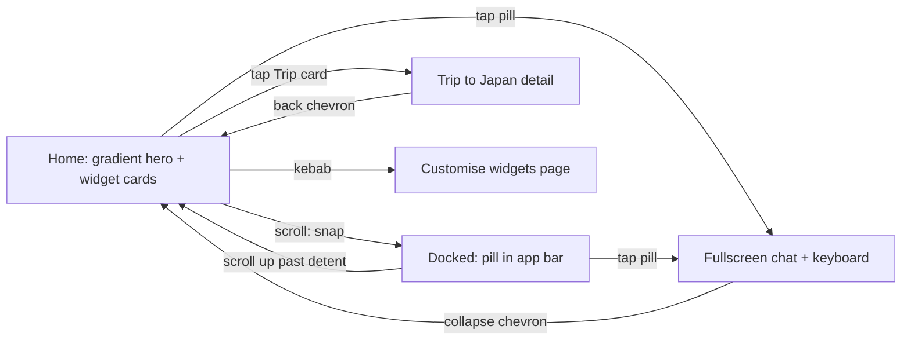

# return exp1 — returning-user dashboard experiment

A reference for the **return exp1** persona: a returning-user dashboard experiment where
"Ask cosimo" is available everywhere and morphs with the surface. It renders at
`/app/return-exp1`, driven by a single self-contained simulator (**ReturnExp1Sim**, no
user-state preset — content is static per the Figma frames).

**Canonical Figma:** [AI Banker · Section 1](https://www.figma.com/design/qo0U58MJSHQ3o4E0QUaDRK/AI-Banker?node-id=1420-28634)
— frames `1420:21632` (rest), `1420:24650` (scrolled/docked), `1420:22471` (fullscreen ask).
Feedback rounds R2–R4 (2026-08-12, agentation) shaped everything below the three base states.

---

## The surfaces

| State | Surface | Ask cosimo pill | Chrome |
|---|---|---|---|
| **Rest** | V-500 + gradient hero (rounded-b 36), white cards below | 320×57 in-flow inside the hero (rides native scroll — zero lag) | Transparent bar, white glyphs, frosted white-16 chips |
| **Docked** | White (the hero gradient fades out whole-surface — never a white band cutting the colour) | 182×48 centered in the app bar, dark label, frosted | Frosted white bar + hairline, dark glyphs |
| **Fullscreen** | White (hero grows over the frame, whitens late) | 320×57 pinned 28px above the keyboard — a REAL input with a send button | White chips; back chevron rotates 90° → collapse |

## Motion

- **Scrolling is native and untouched (R9).** No snap detents, no scroll hijacking, no
  dock state machine — all of that was removed after it kept reading as jerky on
  cheap devices. The ask pill is CSS `position: sticky` (pins under the app bar,
  compositor-only), and the chrome flip — bar whitening, page veil, gradient fade,
  glyph and label crossfades — rides ONE CSS variable (`--re1-t`) written straight
  to the DOM from the scroll listener. Zero React re-renders and zero layout work
  while scrolling; the only animated blur layers are constant, never toggled.
- **Springs remain for the occasional moves**: chat expand `250/28`, page switch
  `190/26`, sheet `300/30` — rAF springs, interruptible, velocity-preserving.
- Fullscreen springs the scroller home, grows the hero over the frame, flips copy
  white → dark early (the chat is a white surface), reveals suggestions with a
  cascade, rides the keyboard mock up.
- Hidden document (backgrounded app): springs snap to target instead of freezing.

## Page transitions — one orchestration, every arrival (R11)

No slide and no page spring: the incoming page's surface lands opaque at once and
only the OUTGOING page fades out (~200ms) — cross-fading both left a window where
each was semi-transparent and the grey page colour showed through the white hero,
which read as a background flicker. On that surface the page plays the SAME entrance
every time — quick, gentle, strictly
top-to-bottom, so the reader always gets the words before the cards:

1. **Chrome** (back chevron, kebab) fades in first — 240ms.
2. **Hero copy** — heading + insight block rise in (360/520ms, 90ms delay).
3. **Insight dissolves in top-to-bottom** after a 260ms beat: a soft mask edge
   sweeps down the paragraph (`mask-position` on a 300%-tall gradient, so it works
   whatever the copy wraps to). No typewriter, no cursor.
4. **Ask pill + cards** cascade below from 380ms into the dissolve — the pill shares
   the first card's beat, then 55ms per row, 16px rise.

Both pages stay mounted (the inactive one fully inert — every interactive child is
gated by page activity, since pointer-events:auto punches through a parent's none).
One generative machine, keyed by the page, owned by whichever page is showing: the
arrival alone sets its state (a per-page pair that reset itself in cleanup could
leave a page stuck mid-build).

The hero **hugs its own copy** on every page, so the pill and the hero edge sit
right under whatever that page says. Its white keeps heading, insight and pill on
pure white, and hangs the softening into the grey 72px BELOW the hero edge, over
the top of the cards.

The scroll dock morph is scrubbed: the sticky pill shrinks and centres into the app
bar as a calc() of the same `--re1-t` variable (completing ~40px before it pins, so
it never clips the chips), with the cosimo avatar fading in — zero JS and zero React
per scroll frame. Detail pages (trip, budget, payments, cashflow inflows/outflows)
share one slot; every card on home opens one.

## Ask placement — in hero vs bottom bar (debug-selectable)

**In hero** (default) — the pill lives in the hero and docks into the app bar on scroll.

**Bottom bar** (Figma `1577:55074`) — the pill floats at the bottom like a chat bar:
permanent chrome that never re-enters on a page change, frosted so cards read
through it, sitting on a scrim that dissolves the content into the page surface
behind it — grey at rest, white once the scroll whitens the page (two stacked
gradients, opacity-only crossfade) — no dock morph (the hero ends just under its copy and pages carry no
dock filler, so short pages end right under their last card). The chat opens from
the bar and stays there — the input keeps its spot at the bottom with the thread
above it (no mock keyboard), the collapse chevron points DOWN, and the thread
persists: the bar reads **"Continue your chat"** once one exists.

## Themes — Original vs V2 paper (debug-selectable)

Two full design treatments share every interaction (snap dock, chat expand, hero-holds
page switch, widget customiser). Switch from **Theme** in the debug panel — the desktop
side column and the mobile 3-finger sheet both render it (`app/lib/protoFlags.ts`), and
the choice persists across reloads.

- **Original** — the Valentino gradient hero on a white page (Figma 1420:28634). Untouched.
- **V2 paper** — the white-first redesign (Figma `1528:49462`), ported verbatim:
  - Grey page (`#F3F5F6`), flat white cards (no drop shadow), white hero with dark copy;
    the ask input is a solid white pill with the gradient orb (which is also the send
    button in chat), straddling the hero→page seam by 26px like the frame.
  - Home cards: **Trip to Japan** (65% done, magenta gradient progress + end dot),
    **₹30,002 left** (green gradient + 34px category circles), **3 Upcoming payments**
    (calendar tiles: blue OCT strip, day, hairline-separated columns),
    **spending spiked** (bar chart, grey bars + gradient highlight bar, dashed peak
    rule + ₹44,245). "Upcoming payments" ships on by default in this theme (until the
    user customises widgets, which then wins).
  - Trip detail and chat inherit the theme: dark generative insight, gradient SIP
    progress, flat cards; chrome is always dark-glyphs-on-light.
  - Assets: `orb.png`, `bar-highlight.png` (exported from the frame).

## Chat (fullscreen)

- The pill becomes a live input (send button appears on the right, lights up with a draft;
  Enter also sends). Suggestion rows are tappable and send their question.
- Canned cosimo replies: exact answers for the three suggestions, a rotating pool otherwise.
  Thread = user bubbles right / cosimo typewriter left, with the "Thinking" pulse.
- Chat-mode chrome dissolves: the collapse chip goes ghost (glyph only), the kebab leaves,
  and the thread fades under the input (gradient, no sharp clip). The thread is staged —
  it appears only near full-open and is gone before the collapse moves the hero (no
  mid-flight overlap).

## Trip to Japan detail (tap the trip stat card)

Same shell — gradient hero ("Trip to Japan" + generated insight), ask pill below, then:
- **SIP contributions** — 8 of 12, progress bar, month-wise tick/skip grid (May skipped).
- **Lumpsum** (own card) — "₹6,000 lumpsum looks doable" + Valentino-subtle Add chip → queued.
- **Atom contributions** — ₹53,000, month grid (ticks/skips/due), MF-SIP ₹5,000/mo footer.
- **Pace** — positive-subtle DlsTag "12 days ahead" (canonical goal-status treatment).
All authored cards: 24px padding, no interior hairlines (cards are clean inside), tertiary
captions — the R5 "more white, more slice" pass. The three home cards stay per Figma.
Month cells: 32px circles — GREEN_50 + tick (contributed), RED_50 + cross (skipped),
dashed outline (due). Metadata month initials beneath.

## Widgets (kebab → full page)

Full-page customiser (spring slide-up, back chevron + Primary "Done"): rows carry a
drag grip (pointer drag to reorder — order drives the home stack), a switch (hide without
losing the spot), and an "Add widgets" section (Upcoming bills, Subscriptions) — each
renders as a real card on home. The kebab chip itself leaves the chat screen (fades out
with the expansion).

## exp5 (back on)

The ask pill waits for the insight before it appears — `EXP5_PILL_AFTER_TYPE` is
true in ReturnExp1Sim, and the pill now shares the first card's beat so it arrives
with the cards rather than a step ahead of them.

## Mobile performance

- Scroll position lives in refs — scrolling never re-renders the tree; the overlay
  pill's rest endpoint is frozen into state at each morph start instead.
- Card stacks are memoized elements — React bails out of the card subtrees on every
  spring frame.
- Backdrop blurs are constant-radius (opacity animates; the radius never does).
- The in-app status bar hides on mobile; the app already ships
  `apple-mobile-web-app-status-bar-style: black-translucent` + `viewport-fit: cover`,
  so the gradient runs clean under the real iOS status bar.

## Content (per Figma + R2)

- Hero: "Welcome back 👋🏼" + "You're ₹3,200 closer to your Trip to Japan goal…"
- Home cards: Trip to Japan 65% (tappable), Left to spend ₹16,900 (category circles with
  progress arcs), Cashflow ₹26,000 / Income ₹80,000 / Spent ₹26,543 + drawn line chart
  (code-drawn SVG — dots, lines, grid and month labels share one x-grid, per R2 alignment
  feedback), plus optional Upcoming bills / Subscriptions widgets.

## Assets (`public/return-exp1/`)

| File | Source |
|---|---|
| `gradient-v21.png` | Figma export of the hero "Gradient V21" node (composited) |
| `chart-lines.svg`, `chart-graph.svg` | Figma chart exports (kept for reference; the card now draws the chart in code with the same `#04E762` / `#FF715B`) |
| `icons/*.svg` | DLS category icons from the Figma payload, fills → `currentColor` |
| `kebab.svg` | Interface/Other 3-dot (inlined in the component as currentColor paths) |
| `suggest-*.png` | Designer-authored suggestion art (downscaled to 112px) |

## Known deviations / flags

- **Emoji 👋🏼** in the hero heading is verbatim from the Figma frame. slice lint flags it
  (emoji ban); kept because the designer authored it — swap for a slice asset to go clean.
- The suggestion rows are `opacity: 0` in every Figma frame; this proto reveals them in the
  fullscreen state (they were clearly drafted for it).
- Proto-local colours from the frames (not DLS tokens): stat progress `#6976EB` / `#D9D9D9`,
  chart `#04E762` / `#FF715B`.
- The gradient PNG is a light-mode asset; dark mode gets correct tokens on text/cards but
  keeps it as-is.
