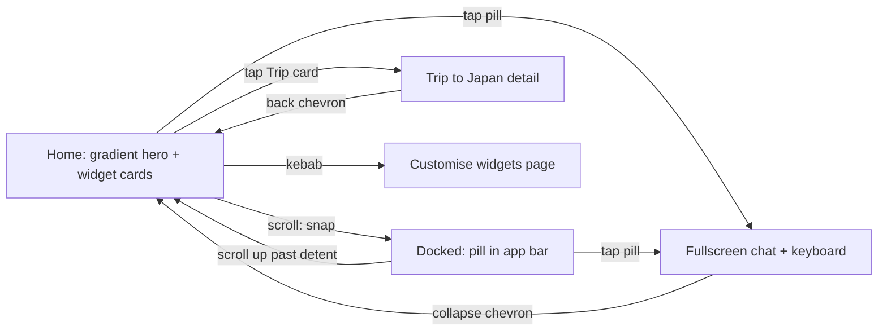

# return exp1 — returning-user dashboard experiment

A reference for the **return exp1** persona: a returning-user dashboard experiment where
"Ask cosimo" is available everywhere and morphs with the surface. It renders at
`/app/return-exp1`, driven by a single self-contained simulator (**ReturnExp1Sim**, no
user-state preset — content is static per the Figma frames).

**Canonical Figma:** [AI Banker · Section 1](https://www.figma.com/design/qo0U58MJSHQ3o4E0QUaDRK/AI-Banker?node-id=1420-28634)
— frames `1420:21632` (rest), `1420:24650` (scrolled/docked), `1420:22471` (fullscreen ask).
Feedback rounds R2–R4 (2026-08-12, agentation) shaped everything below the three base states.

---

## The surfaces

| State | Surface | Ask cosimo pill | Chrome |
|---|---|---|---|
| **Rest** | V-500 + gradient hero (rounded-b 36), white cards below | 320×57 in-flow inside the hero (rides native scroll — zero lag) | Transparent bar, white glyphs, frosted white-16 chips |
| **Docked** | White (the hero gradient fades out whole-surface — never a white band cutting the colour) | 182×48 centered in the app bar, dark label, frosted | Frosted white bar + hairline, dark glyphs |
| **Fullscreen** | White (hero grows over the frame, whitens late) | 320×57 pinned 28px above the keyboard — a REAL input with a send button | White chips; back chevron rotates 90° → collapse |

## Motion

- **Everything is a spring** — one rAF spring (interruptible, velocity-preserving) per
  progress value: dock `280/30`, fullscreen `250/28`, page switch `240/30`, sheet `300/30`.
- **Snap dock**: scrolling ~72px past rest triggers the dock and the scroller snaps past
  the hero (cards rest under the chrome, Figma scrolled frame y≈116). Scrolling up past the
  detent snaps home — the morph starts *with* the gesture, both directions.
- The pill lives **in-flow at rest** and promotes to a morphing overlay only while
  docking/expanding — so it never counter-scrolls the page.
- Fullscreen springs the scroller home, grows the hero over the frame, flips copy
  white → dark late, reveals suggestions with a cascade, rides the keyboard mock up.
- Hidden document (backgrounded app): springs snap to target instead of freezing mid-morph.
  Side effect worth knowing — mid-flight motion cannot be sampled from a hidden browser
  pane, so motion has to be judged live on screen, not asserted in a headless check.

## Page transitions — freeze → move → settle

The first version ran three clocks at once on a navigation from a *scrolled* page: a 380ms
cubic scroll tween, the dock spring undocking, and the page spring crossfading — plus the
gradient and chrome fades derived from the dock. Nothing arrived together, so the header
"going away" read as a jerk. Two state bugs compounded it: the pill's rest anchor was
recomputed from the *incoming* page's scroll while the outgoing page was still scrolled, and
`openFull` sprang the page to its top without clearing the dock, so closing the chat flew the
pill back into the app bar over an already-top-scrolled page.

The architecture now has one rule: **pages don't mutate while they move.**

1. **Freeze** — the destination is reset to its top before it is visible, and both scrollers
   go `overflow: hidden` for the duration. No scroll tween races the slide.
2. **Move** — one spring drives the whole switch. Forward, the destination arrives from the
   right and the outgoing page leaves left; it reverses for free on the way back.
3. **Settle** — the dock **carries across** the move (like an iOS large title on a push).
   Only after the spring lands does the chrome resolve: the off-screen page's scroll is
   reset (invisible, so free) and the pill blooms out of the bar into the destination hero
   as its own follow-through beat, with the purple gradient blooming on the same spring.

## The three transition modes (debug-selectable)

Switchable live from **Page transition** in the debug panel — the desktop control column and
the mobile 3-finger sheet both render it. The choice persists across reloads.

| Mode | What moves | Feel |
|---|---|---|
| **Push** (default) | Rigid slabs translate the full frame width; each page keeps its own hero height; no crossfade, no card parallax | Native push. Most legible direction. |
| **Drift** | Crossfade over a short 22% drift; hero heights blend so the silhouette glides; copy drifts 16%; cards stagger | The fluid switch, horizontal. Softest. |
| **Hero holds** | Hero never translates; only the card stacks push the full width | Reads as one persistent hero with content swapping under it. |

`Hero holds` gets that feel by holding the in-flow hero still rather than structurally
lifting it out of both scrollers. The full lift was considered and rejected: it would put the
hero back on JS scroll-linked motion, which is exactly what caused the counter-scroll lag
fixed by moving the pill in-flow.

Mechanism: `app/lib/protoFlags.ts` — a small generic dev-flag registry for sims that render
straight from the route and have no `UserState` preset to hang substate controls off. Any
future sim can register options there and get both debug surfaces for free.

## Chat (fullscreen)

- The pill becomes a live input (send button appears on the right, lights up with a draft;
  Enter also sends). Suggestion rows are tappable and send their question.
- Canned cosimo replies: exact answers for the three suggestions, a rotating pool otherwise.
  Thread = user bubbles right / cosimo typewriter left, with the "Thinking" pulse.
- Chat-mode chrome dissolves: the collapse chip goes ghost (glyph only), the kebab leaves,
  and the thread fades under the input (gradient, no sharp clip). The thread is staged —
  it appears only near full-open and is gone before the collapse moves the hero (no
  mid-flight overlap).

## Trip to Japan detail (tap the trip stat card)

Same shell — gradient hero ("Trip to Japan" + generated insight), ask pill below, then:
- **SIP contributions** — 8 of 12, progress bar, month-wise tick/skip grid (May skipped).
- **Lumpsum** (own card) — "₹6,000 lumpsum looks doable" + Valentino-subtle Add chip → queued.
- **Atom contributions** — ₹53,000, month grid (ticks/skips/due), MF-SIP ₹5,000/mo footer.
- **Pace** — positive-subtle DlsTag "12 days ahead" (canonical goal-status treatment).
All authored cards: 24px padding, no interior hairlines (cards are clean inside), tertiary
captions — the R5 "more white, more slice" pass. The three home cards stay per Figma.
Month cells: 32px circles — GREEN_50 + tick (contributed), RED_50 + cross (skipped),
dashed outline (due). Metadata month initials beneath.

## Widgets (kebab → full page)

Full-page customiser (spring slide-up, back chevron + Primary "Done"): rows carry a
drag grip (pointer drag to reorder — order drives the home stack), a switch (hide without
losing the spot), and an "Add widgets" section (Upcoming bills, Subscriptions) — each
renders as a real card on home. The kebab chip itself leaves the chat screen (fades out
with the expansion).

## exp5 (reverted 2026-08-12)

Trip-page pill popping in after the insight typed. Reverted — `EXP5_PILL_AFTER_TYPE`
is false in ReturnExp1Sim; flip to true to bring it back.

## Mobile performance

- Scroll position lives in refs — scrolling never re-renders the tree; the overlay
  pill's rest endpoint is frozen into state at each morph start instead.
- Card stacks are memoized elements — React bails out of the card subtrees on every
  spring frame.
- Backdrop blurs are constant-radius (opacity animates; the radius never does).
- The in-app status bar hides on mobile; the app already ships
  `apple-mobile-web-app-status-bar-style: black-translucent` + `viewport-fit: cover`,
  so the gradient runs clean under the real iOS status bar.

## Content (per Figma + R2)

- Hero: "Welcome back 👋🏼" + "You're ₹3,200 closer to your Trip to Japan goal…"
- Home cards: Trip to Japan 65% (tappable), Left to spend ₹16,900 (category circles with
  progress arcs), Cashflow ₹26,000 / Income ₹80,000 / Spent ₹26,543 + drawn line chart
  (code-drawn SVG — dots, lines, grid and month labels share one x-grid, per R2 alignment
  feedback), plus optional Upcoming bills / Subscriptions widgets.

## Assets (`public/return-exp1/`)

| File | Source |
|---|---|
| `gradient-v21.png` | Figma export of the hero "Gradient V21" node (composited) |
| `chart-lines.svg`, `chart-graph.svg` | Figma chart exports (kept for reference; the card now draws the chart in code with the same `#04E762` / `#FF715B`) |
| `icons/*.svg` | DLS category icons from the Figma payload, fills → `currentColor` |
| `kebab.svg` | Interface/Other 3-dot (inlined in the component as currentColor paths) |
| `suggest-*.png` | Designer-authored suggestion art (downscaled to 112px) |

## Known deviations / flags

- **Emoji 👋🏼** in the hero heading is verbatim from the Figma frame. slice lint flags it
  (emoji ban); kept because the designer authored it — swap for a slice asset to go clean.
- The suggestion rows are `opacity: 0` in every Figma frame; this proto reveals them in the
  fullscreen state (they were clearly drafted for it).
- Proto-local colours from the frames (not DLS tokens): stat progress `#6976EB` / `#D9D9D9`,
  chart `#04E762` / `#FF715B`.
- The gradient PNG is a light-mode asset; dark mode gets correct tokens on text/cards but
  keeps it as-is.
