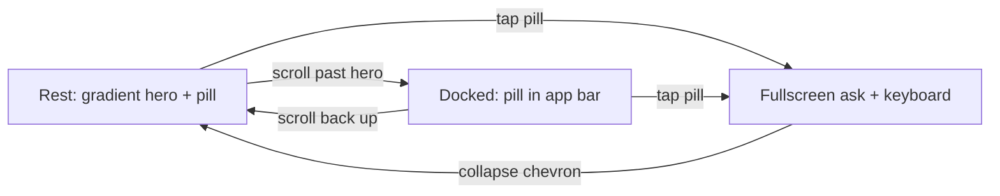

# return exp1 — returning-user dashboard experiment

A reference for the **return exp1** persona: a returning-user dashboard experiment where
"Ask cosimo" is available everywhere and morphs with the surface. It renders at
`/app/return-exp1`, driven by a single self-contained simulator (**ReturnExp1Sim**, no
user-state preset — content is static per the Figma frames).

**Canonical Figma:** [AI Banker · Section 1](https://www.figma.com/design/qo0U58MJSHQ3o4E0QUaDRK/AI-Banker?node-id=1420-28634)
— frames `1420:21632` (rest), `1420:24650` (scrolled/docked), `1420:22471` (fullscreen ask).

---

## The three states

| State | Surface | Ask cosimo pill | Chrome |
|---|---|---|---|
| **Rest** | V-500 + gradient hero (rounded-b 36), white cards below | 320×57 inside the hero, white-20 bg, white label | Transparent bar, white glyphs, white-10 chips |
| **Docked** | White | 182×48 centered in the app bar, dark label | White bar, dark glyphs, white chips + card shadow |
| **Fullscreen** | White (gradient fades out) | 320×57 pinned 28px above the keyboard | White chips; back chevron rotates 90° → collapse |

## Motion

- **Everything is a spring** — one rAF spring (`stiffness 320, damping 32`, interruptible,
  velocity-preserving) drives two progress values: `dock` (0↔1) and `fullscreen` (0↔1).
- The pill is **one shared element**: its rect is interpolated rest → docked → fullscreen,
  so every transition is a real morph, never a crossfade of two pills.
- Scroll itself is native; docking triggers with hysteresis (dock when the pill's natural
  top reaches the app-bar row, undock 20px later) so the morph never flickers.
- Fullscreen also springs the scroller home, fades the hero gradient to white (the welcome
  copy crossfades white → dark), drops the cards away, reveals the three suggestion rows
  with a small cascade, and rides the iOS keyboard mock up.
- Hidden document (backgrounded app): springs snap to target instead of freezing mid-morph.

## Content (per Figma)

- Hero: "Welcome back 👋🏼" + "You're ₹3,200 closer to your Trip to Japan goal…"
- Cards: Trip to Japan 65% (indigo progress), Left to spend ₹16,900 (category circles with
  per-category progress arcs), Cashflow ₹26,000 / Income ₹80,000 / Spent ₹26,543 + line chart.
- Suggestions (fullscreen): biggest spends / top categories / what spending says about me.

## Assets (`public/return-exp1/`)

| File | Source |
|---|---|
| `gradient-v21.png` | Figma export of the hero "Gradient V21" node (composited) |
| `chart-lines.svg`, `chart-graph.svg` | Figma chart exports (green `#04E762`, coral `#FF715B`) |
| `icons/*.svg` | DLS category icons from the Figma payload, fills → `currentColor` |
| `kebab.svg` | Interface/Other 3-dot (inlined in the component as currentColor paths) |
| `suggest-*.png` | Designer-authored suggestion art (downscaled to 112px) |

## Known deviations / flags

- **Emoji 👋🏼** in the hero heading is verbatim from the Figma frame. slice lint flags it
  (emoji ban); kept because the designer authored it — swap for a slice asset to go clean.
- The suggestion rows are `opacity: 0` in every Figma frame; this proto reveals them in the
  fullscreen state (they were clearly drafted for it).
- Stat-block progress colours (`#6976EB` fill, `#D9D9D9` groove) are proto-local values from
  the frame, not DLS tokens.
- Chart SVGs and the gradient PNG are light-mode assets; dark mode gets correct tokens on
  text/cards but keeps those assets as-is.
